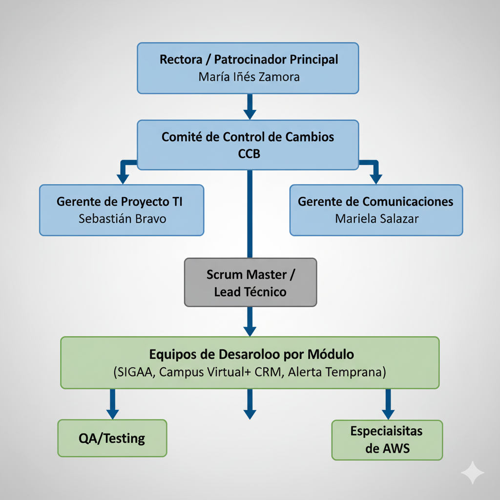

# Plan de dirección de proyecto

## *[Transformación Digital Crecer Más]*

***Fecha: [25-09-2025]***

---
### Tabla de contenido
* [Información del proyecto](#información-del-proyecto-)
* [Aprobaciones](#aprobaciones-)
* [Introducción](#introducción)
* [Plan de gestión del alcance](#plan-de-gestión-del-alcance)
* Plan de gestión de requerimientos	[6](#_toc15313863)
* Plan de gestión del cronograma	[7](#_toc15313864)
* Plan de gestión de costos	[7](#_toc15313865)
* Plan de gestión de calidad	[8](#_toc15313866)
* Plan de gestión de recursos	[8](#_toc15313867)
* Plan de gestión de comunicaciones	[9](#_toc15313868)
* Plan de gestión de riesgos de un proyecto	[9](#_toc15313869)
* Plan de gestión de adquisiciones	[10](#_toc15313870)
* Plan de gestión de los interesados	[10](#_toc15313871)
* Líneas base del proyecto	[11](#_toc15313872)
* Línea base de alcance	[11](#_toc15313873)
* Línea base de cronograma	[11](#_toc15313874)
* Línea base de costo	[12](#_toc15313875)
* Línea base para la medición del desempeño	[12](#_toc15313876)
* Componentes adicionales del plan de gestión de proyectos	[13](#_toc15313877)
* Plan de gestión de cambios	[13](#_toc15313878)
* Plan de gestión de configuración	[13](#_toc15313879)
* Descripción del ciclo de vida del proyecto	[14](#_toc15313880)
* Enfoque de desarrollo del plan de proyecto	[14](#_toc15313881)
* Evaluaciones de la gerencia	[15](#_toc15313882)

---
### Información del proyecto

**Datos**

| Empresa / Organizacion | Crecer Más                        |
| :--------------------- | :-------------------------------- |
| Proyecto               | Transformación Digital Crecer Más |
| Fecha de preparación   | 26-08-2025                        |
| Cliente                | Crecer Más                        |
| Patrocinador principal |                                   |
| Gerente de Proyecto    |                                   |

**Patrocinador / Patrocinadores**

| **Nombre** | **Cargo** | **Departamento / División** | **Rama ejecutiva (Vicepresidencia)** |
| :--------: | :-------: | :-------------------------: | :----------------------------------: |
|            |           |                             |                                      |
|            |           |                             |                                      |

---
### Aprobaciones

|        **Nombre / Cargo**        | **Fecha** | **Firma** |
| :------------------------------: | :-------: | :-------: |
| 
<h2></h2>

<h2></h2>
 | <h2></h2> | <h2></h2> |
| 
<h2></h2>

<h2></h2>
 | <h2></h2> | <h2></h2> |
| 
<h2></h2>

<h2></h2>
 | <h2></h2> | <h2></h2> |
| 
<h2></h2>

<h2></h2>
 | <h2></h2> | <h2></h2> |

---
### Introducción

## Descripción de Alto Nivel del Proyecto

### ¿De qué se trata?

El proyecto "Transformación Digital Integral" consiste en la modernización completa de la infraestructura tecnológica y sistemas académicos del Instituto Técnico Profesional Crecer Más. Se implementarán cuatro módulos tecnológicos integrados: Sistema de Gestión Académica y Administrativa, Campus Virtual+, Sistema de Alerta Temprana con Analítica Predictiva, y CRM Educativo con Plataforma de Admisión Automatizada.

### Razón de Ser

La institución enfrenta importantes brechas tecnológicas que limitan su crecimiento y competitividad: procesos manuales de matrícula, falta de trazabilidad académica, escasa presencia digital, infraestructura limitada para comunicación entre sedes, y carencia de herramientas escalables de gestión estudiantil. Esta transformación es crítica para posicionar al instituto como líder en formación técnica con modalidad híbrida a nivel nacional.

### Alcance del Proyecto

El proyecto abarcará las tres sedes actuales (San Bernardo, Maipú y Renca) con una población de 2.500 estudiantes. Incluye la implementación de arquitectura en la nube (AWS), migración de sistemas legacy, integración de plataformas educativas, desarrollo de capacidades de inteligencia artificial para predicción de deserción, y habilitación de servicios digitales para estudiantes, docentes y personal administrativo.

### Beneficios Esperados

- **Crecimiento:** Duplicación de matrícula en 5 años
- **Retención:** Reducción de deserción estudiantil en 30%
- **Expansión:** Habilitación para crecimiento a 3 regiones adicionales
- **Eficiencia:** Automatización de procesos administrativos y académicos
- **Competitividad:** Mejor posicionamiento y reputación digital
- **Experiencia:** Mejora significativa en servicios estudiantiles y docentes

### Inversión y Modalidad

**Inversión Total:** $480.000.000 CLP distribuidos en 18 meses de ejecución

**Modalidad de Ejecución:** Enfoque híbrido que combina metodologías predictivas para infraestructura y componentes ágiles para desarrollo de software, con entregas incrementales por módulo para minimizar riesgos y maximizar valor temprano.

---
### [Plan de gestión del alcance](./Plan%20de%20Gestión%20de%20Alcance/index.md)

## 1. Procedimientos para Elaborar la Definición de Alcance

### Metodología de Definición

El alcance del proyecto será definido mediante un proceso estructurado que incluye:

- **Recopilación de requisitos** mediante entrevistas con stakeholders clave (Rectora, Directores, Coordinadores de Carrera)
- **Talleres de levantamiento** con usuarios finales por cada módulo tecnológico
- **Análisis de procesos actuales** y documentación de brechas tecnológicas identificadas
- **Revisión de documentación existente** y evaluación de sistemas legacy
- **Validación formal** con patrocinadores de cada módulo antes de la aprobación final

### Documentación del Alcance

La definición de alcance incluirá:

- **Alcance del producto:** Descripción detallada de los cuatro módulos tecnológicos y sus características
- **Alcance del proyecto:** Trabajo necesario para entregar el producto con las especificaciones requeridas
- **Criterios de aceptación:** Condiciones que deben cumplirse para aprobar cada entregable
- **Exclusiones del proyecto:** Elementos explícitamente fuera del alcance
- **Restricciones:** Limitaciones técnicas, presupuestarias y de tiempo
- **Supuestos:** Premisas consideradas verdaderas para la planificación

---

## 2. Procedimientos para Elaborar la Estructura de Desglose de Trabajo (EDT)

### Metodología para Crear la EDT

La EDT del proyecto se desarrollará siguiendo estos lineamientos:

- **Descomposición jerárquica** orientada a entregables verificables
- **Descomposición progresiva** hasta alcanzar paquetes de trabajo de 40-80 horas de duración
- **Numeración jerárquica estándar** (1.1, 1.1.1, 1.1.2, etc.) según estándares PMI
- **Identificación de entregables** por cada nivel de descomposición
- **Vinculación directa** con el cronograma del proyecto y la estructura de costos
- **Validación** con líderes técnicos y patrocinadores de cada módulo

### Niveles de la EDT

La estructura contempla los siguientes niveles:

- **Nivel 1:** Proyecto completo (Transformación Digital Integral)
- **Nivel 2:** Módulos principales del proyecto (SIGAA, Campus Virtual+, Alerta Temprana, CRM, Infraestructura)
- **Nivel 3:** Componentes específicos por módulo
- **Nivel 4:** Paquetes de trabajo detallados

### Herramientas y Documentación

- **Herramienta principal:** Microsoft Project para desarrollo y control
- **Diccionario de la EDT:** Documento complementario con descripciones detalladas de cada elemento
- **Control de versiones:** Registro formal de cambios en la estructura

> **Nota:** La EDT completa del proyecto se encuentra disponible en el **Anexo A: Estructura de Desglose del Trabajo**.

---

## 3. Procedimientos de Aprobación y Modificación de la Línea Base de Alcance

### Línea Base de Alcance

La línea base de alcance está compuesta por:

- Enunciado del alcance del proyecto aprobado
- Estructura de Desglose del Trabajo (EDT)
- Diccionario de la EDT

### Autoridades de Aprobación por Nivel de Impacto

Los cambios a la línea base de alcance requieren aprobación según su magnitud:

| Tipo de Cambio | Impacto Económico | Autoridad de Aprobación |
|----------------|-------------------|-------------------------|
| **Cambios Menores** | < $5.000.000 | Gerente de Proyecto (Ignacio Beltrán) |
| **Cambios Moderados** | $5M - $15M | Patrocinador del Módulo + Director de Finanzas |
| **Cambios Mayores** | $15M - $30M | Comité Ejecutivo + Rectora |
| **Cambios Críticos** | > $30.000.000 | Aprobación unánime del Comité Ejecutivo |

### Proceso de Gestión de Cambios

Todo cambio a la línea base de alcance debe seguir este procedimiento:

1. **Solicitud formal de cambio** utilizando el formato estandarizado con justificación de negocio y técnica
2. **Análisis de impacto** en alcance, cronograma, costos, calidad y riesgos del proyecto
3. **Evaluación técnica** por el Gerente de Proyecto y Director de TI
4. **Presentación** a la autoridad de aprobación correspondiente según tabla de umbrales
5. **Decisión formal** con registro de aprobación o rechazo y justificación
6. **Comunicación** de la decisión a todos los stakeholders afectados
7. **Actualización** de la línea base y toda la documentación relacionada del proyecto

### Registro y Trazabilidad

- Todas las solicitudes de cambio serán registradas en el **Log de Control de Cambios**
- Se mantendrá histórico completo de cambios aprobados y rechazados
- Las versiones de la línea base serán controladas y archivadas formalmente

---

## 4. Procedimientos de Aprobación de los Entregables

### Criterios de Aceptación

Cada entregable del proyecto debe cumplir con:

- **Requisitos funcionales** documentados y acordados con el patrocinador
- **Estándares de calidad** técnicos y de usuario definidos en el plan de calidad
- **Pruebas exitosas** de funcionalidad, rendimiento y seguridad
- **Documentación completa** técnica y de usuario según templates establecidos
- **Capacitación impartida** al personal responsable de operar el entregable

### Proceso de Validación y Aprobación

El proceso formal de aprobación de entregables contempla:

1. **Revisión Técnica Interna**
   - Equipo de TI valida funcionalidades técnicas
   - Verificación de cumplimiento de requisitos no funcionales
   - Ejecución de pruebas técnicas y de integración

2. **Pruebas de Aceptación de Usuario (UAT)**
   - Usuarios finales ejecutan casos de prueba específicos
   - Validación de usabilidad y cumplimiento de expectativas
   - Registro formal de resultados y observaciones

3. **Aprobación Funcional**
   - Patrocinador del módulo revisa y aprueba el entregable
   - Validación de alineamiento con objetivos de negocio
   - Confirmación de criterios de aceptación cumplidos

4. **Aprobación Final del Gerente de Proyecto**
   - Verificación de completitud de documentación
   - Confirmación de liberación de recursos
   - Autorización para puesta en producción

5. **Registro Formal**
   - Elaboración de Acta de Aceptación firmada
   - Actualización del estado en el sistema de gestión del proyecto
   - Archivo en repositorio oficial del proyecto

### Responsables de Aprobación por Módulo

| Módulo | Patrocinador Responsable | Cargo |
|--------|-------------------------|-------|
| **SIGAA** | Patricio Núñez | Director Académico |
| **Campus Virtual+** | María Inés Zamora | Rectora |
| **Sistema Alerta Temprana** | Carolina Rivas | Directora de Vinculación con el Medio |
| **CRM Educativo** | Paula Araya | Jefa de Admisión |
| **Infraestructura** | Sebastián Bravo | Director de TI |

### Frecuencia de Revisiones

- **Revisiones de avance:** Semanales por módulo con líderes técnicos
- **Revisiones formales:** Quincenales con el Gerente de Proyecto
- **Presentaciones ejecutivas:** Mensuales al Comité Ejecutivo
- **Aprobaciones de hitos:** Según cronograma establecido en el plan de proyecto

### Gestión de No Conformidades

Si un entregable no cumple con los criterios de aceptación:

- Se registra formalmente la no conformidad identificada
- Se genera un plan de acción correctiva con responsables y fechas
- Se reprograma la validación una vez implementadas las correcciones
- Se escala al Comité Ejecutivo si la no conformidad impacta hitos críticos

---

## Documentos de Referencia

- **Anexo A:** Estructura de Desglose del Trabajo (EDT) del Proyecto
- **Anexo B:** Diccionario de la EDT
- **Anexo C:** Matriz de Trazabilidad de Requisitos
- **Anexo D:** Formato de Solicitud de Cambio de Alcance
- **Anexo E:** Template de Acta de Aceptación de Entregables

---
### [Plan de gestión de requerimientos]()

## 1. Planificación, Reporte y Seguimiento de Actividades de Requerimientos

### Metodología de Levantamiento de Requerimientos

El proceso de recopilación y análisis de requerimientos se ejecutará en las siguientes fases:

**Fase 1 - Análisis Organizacional (2 semanas)**
- Entrevistas estructuradas con Directores y personal ejecutivo
- Revisión de procesos institucionales actuales
- Análisis de documentación existente y sistemas legacy
- Identificación de brechas tecnológicas y necesidades estratégicas

**Fase 2 - Levantamiento Funcional por Módulo (4 semanas)**
- Talleres colaborativos con usuarios finales por cada módulo
- Grupos focales con docentes, coordinadores de carrera y personal administrativo
- Sesiones de trabajo con estudiantes para requisitos de experiencia de usuario
- Observación directa de procesos operativos en las 3 sedes

**Fase 3 - Definición de Requisitos Técnicos (2 semanas)**
- Especificación de arquitectura tecnológica requerida
- Definición de integraciones entre sistemas
- Requisitos de infraestructura y seguridad
- Requisitos no funcionales (rendimiento, disponibilidad, escalabilidad)

**Fase 4 - Validación y Priorización (1 semana)**
- Confirmación de requisitos con stakeholders clave
- Priorización según valor de negocio e impacto
- Aprobación formal por patrocinadores de cada módulo

### Técnicas de Recopilación por Tipo de Stakeholder

| Stakeholder | Técnica Principal | Frecuencia |
|------------|-------------------|------------|
| Directores y Ejecutivos | Entrevistas estructuradas | Individual, 1 vez |
| Docentes y Coordinadores | Talleres colaborativos | Grupos de 8-12, 2-3 sesiones |
| Personal Administrativo | Grupos focales | Grupos de 5-8, 2 sesiones |
| Estudiantes | Encuestas + Grupos focales | Muestra representativa |
| Equipo TI | Sesiones técnicas | Múltiples sesiones iterativas |

### Categorización de Requerimientos

Los requerimientos serán clasificados en las siguientes categorías:

**Requerimientos Funcionales por Módulo:**
- **SIGAA:** 85 requisitos estimados (gestión académica, administrativa, reportes, certificados)
- **Campus Virtual+:** 65 requisitos estimados (LMS, videoconferencias, evaluaciones, foros)
- **Sistema Alerta Temprana:** 45 requisitos estimados (algoritmos IA, dashboards, alertas, intervenciones)
- **CRM Educativo:** 55 requisitos estimados (gestión leads, admisión, comunicaciones, campañas)

**Requerimientos No Funcionales Transversales:** 40 requisitos estimados
- Seguridad y privacidad de datos
- Rendimiento y tiempos de respuesta
- Disponibilidad y confiabilidad
- Usabilidad y accesibilidad
- Escalabilidad y mantenibilidad

### Formato de Documentación de Requerimientos

Cada requerimiento será documentado con la siguiente estructura estandarizada:

- **ID Único:** [MÓDULO]-[RF/RNF]-[###]
  - Ejemplo: SIGAA-RF-001, CAMPUS-RNF-015
- **Nombre:** Título descriptivo del requerimiento
- **Descripción:** Narrativa detallada del requerimiento
- **Criterios de Aceptación:** Condiciones verificables de cumplimiento
- **Prioridad:** Alta / Media / Baja (según impacto en objetivos institucionales)
- **Fuente:** Stakeholder o documento de origen
- **Módulo:** Componente del proyecto al que pertenece
- **Estado:** Propuesto / Aprobado / En Desarrollo / Implementado / Validado
- **Responsable:** Persona asignada para su análisis y seguimiento

### Reportes de Seguimiento

**Reporte Semanal de Avance de Levantamiento**
- Destinatario: Gerente de Proyecto (Ignacio Beltrán)
- Contenido: 
  - Número de requisitos capturados por módulo
  - Estado de validación con stakeholders
  - Impedimentos o riesgos identificados
  - Actividades planificadas para la siguiente semana

**Dashboard Quincenal de Estado de Requerimientos**
- Destinatarios: Patrocinadores de módulos y Directores
- Contenido:
  - % de requisitos capturados, validados y aprobados por módulo
  - Distribución por prioridad (Alta/Media/Baja)
  - Requisitos en conflicto o con dependencias complejas
  - Timeline de completitud de levantamiento

**Métricas de Seguimiento (KPIs)**
- **% Requisitos Capturados:** Meta 100% al finalizar Fase 2
- **% Requisitos Validados:** Meta >95% antes de inicio de desarrollo
- **% Requisitos Aprobados:** Meta 100% antes de baseline
- **Tiempo Promedio de Validación:** Meta <5 días hábiles
- **Requisitos Pendientes de Aprobación:** Alertas para >5 días sin respuesta

### Herramientas de Gestión

- **Repositorio Central:** SharePoint con control de versiones y acceso por roles
- **Gestión de Backlog:** Azure DevOps para vinculación requisito-desarrollo
- **Colaboración:** Microsoft Teams para validación y comentarios de stakeholders
- **Reportería:** Power BI para dashboards ejecutivos y métricas en tiempo real
- **Documentación:** Confluence para especificaciones detalladas y casos de uso

---

## 2. Gestión de Cambios de Requerimientos

### Proceso de Iniciación de Cambios

Todo cambio a un requerimiento debe seguir el siguiente procedimiento formal:

**1. Solicitud Formal de Cambio**
- Uso de template estandarizado "Solicitud de Cambio de Requerimiento"
- Identificación del requerimiento a modificar (ID único)
- Descripción detallada del cambio propuesto
- Justificación de negocio o técnica
- Solicitante y fecha de solicitud

**2. Registro en Sistema de Gestión**
- Asignación automática de ID único para la solicitud de cambio
- Logging en Azure DevOps con vinculación al requerimiento original
- Notificación automática al Gerente de Proyecto y analista asignado

**3. Clasificación Inicial**
- Categorización por impacto: Crítico / Alto / Medio / Bajo
- Categorización por urgencia: Inmediata / Alta / Normal / Baja
- Asignación de prioridad según matriz Impacto-Urgencia

**4. Asignación de Responsable**
- Designación de analista de negocio para evaluación detallada
- Definición de fecha límite para análisis según prioridad
- Comunicación al solicitante del responsable y timeline

### Análisis de Impactos

El análisis de impacto debe evaluar todas las dimensiones afectadas:

**Impacto Técnico**
- Cambios en arquitectura de software o infraestructura
- Modificaciones en integraciones con otros sistemas
- Compatibilidad con tecnologías seleccionadas
- Complejidad técnica de implementación

**Impacto Funcional**
- Dependencias con otros requerimientos
- Modificaciones en flujos de trabajo existentes
- Impacto en experiencia de usuario
- Conflictos con requisitos ya aprobados

**Impacto en Cronograma**
- Horas de desarrollo adicionales requeridas
- Efecto en actividades críticas del proyecto
- Impacto en hitos de entrega de módulos
- Necesidad de replantificación de sprints

**Impacto en Costo**
- Esfuerzo de desarrollo (horas hombre)
- Recursos de infraestructura adicionales
- Licencias o servicios externos requeridos
- Costo total estimado del cambio

**Impacto en Riesgos**
- Nuevos riesgos introducidos por el cambio
- Mitigación de riesgos existentes
- Nivel de incertidumbre técnica
- Impacto en calidad del producto

### Niveles de Aprobación por Impacto

Los cambios de requerimientos requieren diferentes niveles de aprobación según su magnitud:

| Impacto del Cambio | Esfuerzo Estimado | Autoridad de Aprobación |
|-------------------|-------------------|-------------------------|
| **Menor** | < 20 horas de desarrollo | Analista de Negocio + Líder Técnico del Módulo |
| **Moderado** | 20 - 80 horas | Gerente de Proyecto + Patrocinador del Módulo |
| **Mayor** | 80 - 160 horas | Comité de Control de Cambios |
| **Crítico** | > 160 horas o impacto en cronograma mayor | Comité Ejecutivo (Rectora + Directores) |

**Comité de Control de Cambios (CCB)**

Composición:
- Ignacio Beltrán (Gerente de Proyecto) - Presidente
- Sebastián Bravo (Director de TI) - Miembro
- Tomás Espinoza (Director de Finanzas) - Miembro
- Patrocinador del módulo afectado - Miembro

Frecuencia de reuniones: Semanal o según demanda

### Registro y Seguimiento de Cambios

**Base de Datos de Control de Cambios**
- Repositorio centralizado en Azure DevOps
- Histórico completo de todas las solicitudes
- Estados del ciclo de vida: Solicitado → En Análisis → Aprobado/Rechazado → Implementado → Cerrado
- Vinculación con requerimientos originales y tareas de desarrollo

**SLA de Respuesta por Prioridad**

| Prioridad | Tiempo de Análisis | Tiempo de Decisión |
|-----------|-------------------|-------------------|
| Crítica | 1 día hábil | 2 días hábiles |
| Alta | 2 días hábiles | 5 días hábiles |
| Media | 5 días hábiles | 10 días hábiles |
| Baja | 10 días hábiles | 15 días hábiles |

**Comunicación de Decisiones**
- Notificación automática al solicitante en cada cambio de estado
- Email formal con decisión final y justificación
- Actualización en dashboard visible para todos los stakeholders
- Sesión informativa en caso de cambios mayores aprobados

**Métricas de Gestión de Cambios**
- Número total de solicitudes de cambio por período
- Tasa de aprobación/rechazo por tipo de impacto
- Tiempo promedio de resolución por prioridad
- Impacto acumulado en cronograma y costo
- Tendencias y análisis de causas raíz

---

## 3. Estructura de Trazabilidad - Matriz de Trazabilidad de Requerimientos (RTM)

**Código de proyecto:** TCIM-2025  
**Proyecto:** Transformación Digital Integral - Instituto Técnico Profesional Crecer Más  
**Elaborado por:** www.pmoinformatica.com

### Matriz de Trazabilidad de Requerimientos

| Identificación | Sub-identificación | Descripción del requisito | Versión | Estado actual | Última fecha estado registrado | Criterios de aceptación | Nivel de complejidad | Necesidad, oportunidades u objetivos de negocio | Objetivo del proyecto | Entregables (EDT) | Diseño del producto | Desarrollo del producto | Estrategia y escenarios de pruebas | Interesado (Stakeholder) dueño del requisito | Nivel de prioridad |
|---|---|---|---|---|---|---|---|---|---|---|---|---|---|---|---|
| SIGAA-RF-001 | - | El estudiante debe poder consultar sus notas en tiempo real desde cualquier dispositivo | 1.0 | Aprobado | 15/08/2025 | Usuario visualiza notas actualizadas en menos de 24 horas, todas las asignaturas visibles, responsive en móvil y desktop | Media | OBJ-01: Mejorar experiencia del estudiante y retención | PROJ-01: Digitalizar gestión académica | 1.1.1 | DOC-UI-PORTAL-001 | SIGAA.Portal.Modulo.Notas | TC-SIGAA-001 a TC-SIGAA-005 | Patricio Núñez (Director Académico) | Alta |
| SIGAA-RF-002 | - | El sistema debe permitir la inscripción de asignaturas online con validación automática de prerequisitos | 1.0 | Aprobado | 15/08/2025 | Validación automática de prerequisitos, bloqueo de asignaturas no disponibles, confirmación inmediata de inscripción | Alta | OBJ-04: Automatizar procesos académicos y reducir carga administrativa | PROJ-01: Digitalizar gestión académica | 1.1.2 | DOC-INSCRIPCION-002 | SIGAA.Academico.Inscripcion | TC-SIGAA-006 a TC-SIGAA-012 | Patricio Núñez (Director Académico) | Alta |
| SIGAA-RF-003 | - | El docente debe poder ingresar y modificar notas con workflow de aprobación | 1.0 | En Desarrollo | 20/09/2025 | Ingreso individual y masivo de notas, workflow de aprobación de coordinador, auditoría completa de cambios | Media | OBJ-04: Mejorar eficiencia operativa y trazabilidad | PROJ-01: Digitalizar gestión académica | 1.1.2 | DOC-NOTAS-003 | SIGAA.Academico.Notas.Workflow | TC-SIGAA-013 a TC-SIGAA-018 | Patricio Núñez (Director Académico) | Alta |
| SIGAA-RF-004 | - | El sistema debe generar certificados digitales con firma electrónica avanzada | 1.1 | Aprobado | 22/08/2025 | Certificados en PDF con código QR de verificación, firma electrónica válida legalmente, generación automática en <3 minutos | Alta | OBJ-05: Posicionamiento como institución moderna y digitalizada | PROJ-01: Digitalizar gestión académica | 1.1.4 | DOC-CERT-004 | SIGAA.Certificados.Generator | TC-SIGAA-019 a TC-SIGAA-024 | Patricio Núñez (Director Académico) | Media |
| SIGAA-RF-005 | - | El sistema debe integrar gestión de pagos con pasarelas de pago online | 2.0 | Aprobado | 28/08/2025 | Integración con Webpay y Mercado Pago, confirmación automática de pago, notificación al estudiante | Alta | OBJ-04: Automatizar procesos financieros | PROJ-01: Digitalizar gestión administrativa | 1.1.3 | DOC-PAGOS-005 | SIGAA.Finanzas.Pagos.API | TC-SIGAA-025 a TC-SIGAA-032 | Tomás Espinoza (Director de Finanzas) | Alta |
| CAMPUS-RF-001 | - | La plataforma LMS debe soportar videoconferencias para hasta 200 participantes simultáneos | 1.0 | Aprobado | 18/08/2025 | Integración con Zoom/BigBlueButton, grabación automática, calidad HD, sin cortes con conexión >5Mbps | Alta | OBJ-05: Facilitar modalidad de enseñanza híbrida | PROJ-02: Implementar plataforma virtual escalable | 1.2.2 | DOC-VIDEO-001 | Campus.Video.Integration | TC-CAMPUS-001 a TC-CAMPUS-008 | María Inés Zamora (Rectora) | Alta |
| CAMPUS-RF-002 | - | El docente debe poder crear evaluaciones con banco de preguntas y diferentes tipos de respuesta | 1.0 | En Desarrollo | 25/09/2025 | Soporte V/F, selección múltiple, desarrollo, matching. Banco reutilizable de preguntas, asignación aleatoria | Media | OBJ-05: Mejorar calidad de evaluación en modalidad online | PROJ-02: Implementar LMS funcional | 1.2.4 | DOC-EVAL-002 | Moodle.Quiz.Custom | TC-CAMPUS-009 a TC-CAMPUS-016 | María Inés Zamora (Rectora) | Alta |
| CAMPUS-RF-003 | - | El estudiante debe poder acceder a materiales de curso offline mediante app móvil | 1.0 | Aprobado | 20/08/2025 | Sincronización automática cuando hay conexión, descarga de PDFs y videos, funcionamiento sin internet | Alta | OBJ-01: Mejorar accesibilidad para estudiantes con conectividad limitada | PROJ-02: Implementar plataforma virtual escalable | 1.2.3 | DOC-MOBILE-003 | Campus.Mobile.Offline | TC-CAMPUS-017 a TC-CAMPUS-024 | María Inés Zamora (Rectora) | Media |
| CAMPUS-RF-004 | - | El sistema debe enviar notificaciones automáticas de nuevas actividades y deadlines | 1.0 | Aprobado | 20/08/2025 | Notificaciones push, email y SMS, configurables por usuario, recordatorios 24hrs antes de deadline | Baja | OBJ-01: Mejorar engagement y cumplimiento de estudiantes | PROJ-02: Implementar LMS funcional | 1.2.3 | DOC-NOTIF-004 | Campus.Notifications.Service | TC-CAMPUS-025 a TC-CAMPUS-030 | María Inés Zamora (Rectora) | Media |
| ALERT-RF-001 | - | El sistema debe predecir riesgo de deserción con accuracy mínimo del 85% | 1.0 | Validado | 05/10/2025 | Modelo ML con precision >85%, recall >80%, F1-score >82%, predicción actualizada semanalmente | Alta | OBJ-02: Reducir deserción estudiantil en 30% | PROJ-03: Implementar analítica predictiva con IA | 1.3.3 | DOC-ML-001 | Alert.ML.PredictionEngine | TC-ALERT-001 a TC-ALERT-010 | Carolina Rivas (Vinculación con el Medio) | Alta |
| ALERT-RF-002 | - | El sistema debe identificar factores de riesgo y generar alertas automáticas a tutores | 1.0 | Implementado | 08/10/2025 | Identificación de top 5 factores de riesgo, alertas en <48hrs, dashboard con estudiantes en riesgo crítico | Alta | OBJ-02: Intervención temprana para prevenir deserción | PROJ-03: Implementar sistema de alertas | 1.3.2 | DOC-ALERT-002 | Alert.Dashboard.RiskFactors | TC-ALERT-011 a TC-ALERT-018 | Carolina Rivas (Vinculación con el Medio) | Alta |
| ALERT-RF-003 | - | El tutor debe poder registrar intervenciones y hacer seguimiento de estudiantes en riesgo | 1.0 | En Desarrollo | 15/10/2025 | Registro de tipo de intervención, fecha, resultado, seguimiento histórico completo, indicadores de efectividad | Media | OBJ-02: Gestionar intervenciones de retención sistemáticamente | PROJ-03: Implementar panel de seguimiento | 1.3.2 | DOC-INTERV-003 | Alert.Tutor.Intervention | TC-ALERT-019 a TC-ALERT-025 | Carolina Rivas (Vinculación con el Medio) | Alta |
| ALERT-RF-004 | - | El sistema debe enviar comunicaciones automatizadas personalizadas a estudiantes en riesgo | 1.1 | Aprobado | 18/10/2025 | Templates personalizables, envío por email/WhatsApp, tracking de apertura, respuesta automática | Media | OBJ-02: Automatizar comunicaciones de retención | PROJ-03: Implementar intervención automatizada | 1.3.4 | DOC-COMUN-004 | Alert.Communication.Auto | TC-ALERT-026 a TC-ALERT-032 | Carolina Rivas (Vinculación con el Medio) | Media |
| CRM-RF-001 | - | El sistema debe capturar leads desde múltiples canales digitales (web, redes sociales, email) | 1.0 | Aprobado | 22/08/2025 | Integración con Facebook Ads, Instagram, formulario web, captura automática de datos, asignación automática a ejecutivo | Alta | OBJ-01: Aumentar captación de estudiantes potenciales | PROJ-04: Automatizar gestión de admisión | 1.4.1 | DOC-LEAD-001 | CRM.Leads.Capture | TC-CRM-001 a TC-CRM-008 | Paula Araya (Jefa de Admisión) | Alta |
| CRM-RF-002 | - | El ejecutivo de admisión debe poder hacer seguimiento completo del prospecto con scoring automático | 1.0 | En Desarrollo | 28/09/2025 | Lead scoring basado en interacción, historial completo de contactos, alertas de seguimiento, conversión a matrícula | Alta | OBJ-01: Mejorar tasa de conversión de leads a matriculados | PROJ-04: Implementar CRM funcional | 1.4.1 | DOC-SCORING-002 | CRM.Leads.Scoring | TC-CRM-009 a TC-CRM-016 | Paula Araya (Jefa de Admisión) | Alta |
| CRM-RF-003 | - | El sistema debe automatizar campañas de email marketing segmentadas por perfil | 1.0 | Aprobado | 25/08/2025 | Segmentación por carrera de interés, edad, región, envío programado, A/B testing, métricas de conversión | Media | OBJ-01: Optimizar comunicaciones de marketing | PROJ-04: Automatizar comunicaciones | 1.4.3 | DOC-EMAIL-003 | CRM.Marketing.Campaigns | TC-CRM-017 a TC-CRM-024 | Paula Araya (Jefa de Admisión) | Media |
| CRM-RF-004 | - | El sistema debe generar formularios de postulación inteligentes con validación en tiempo real | 1.0 | Aprobado | 25/08/2025 | Formulario adaptativo según carrera, validación de RUT, carga de documentos, guardado automático, confirmación por email | Alta | OBJ-04: Simplificar proceso de postulación | PROJ-04: Automatizar admisión | 1.4.2 | DOC-FORM-004 | CRM.Forms.Smart | TC-CRM-025 a TC-CRM-032 | Paula Araya (Jefa de Admisión) | Alta |
| CRM-RF-005 | - | El dashboard debe mostrar métricas de rendimiento de campañas y conversión en tiempo real | 1.0 | Aprobado | 28/08/2025 | KPIs de leads generados, tasa de conversión, costo por lead, ROI de campañas, visualización interactiva | Media | OBJ-04: Toma de decisiones basada en datos | PROJ-04: Implementar dashboard analítico | 1.4.4 | DOC-DASH-005 | CRM.Dashboard.Analytics | TC-CRM-033 a TC-CRM-040 | Mariela Salazar (Comunicaciones) | Media |
| INFRA-RNF-001 | - | La infraestructura debe garantizar 99.5% de disponibilidad con balanceo de carga automático | 1.0 | Aprobado | 20/08/2025 | Uptime >99.5%, balanceadores AWS ELB configurados, failover automático <30 segundos, monitoreo 24/7 | Alta | OBJ-05: Garantizar continuidad operativa | PROJ-05: Migrar a infraestructura cloud | 1.5.1 | DOC-AWS-001 | AWS.ECS.LoadBalancer | TC-INFRA-001 a TC-INFRA-008 | Sebastián Bravo (Director TI) | Alta |
| INFRA-RNF-002 | - | El sistema debe cumplir con encriptación end-to-end y estándares ISO 27001 | 1.0 | Aprobado | 20/08/2025 | Encriptación TLS 1.3, datos en reposo con AES-256, auditoría completa de accesos, cumplimiento GDPR chileno | Alta | OBJ-05: Proteger datos sensibles de estudiantes y personal | PROJ-05: Implementar seguridad robusta | 1.5.2 | DOC-SEC-002 | AWS.Security.Encryption | TC-INFRA-009 a TC-INFRA-016 | Sebastián Bravo (Director TI) | Alta |
| INFRA-RNF-003 | - | El sistema debe responder en menos de 2 segundos para el 95% de las transacciones | 1.0 | En Desarrollo | 25/09/2025 | Response time <2seg percentil 95, <5seg percentil 99, optimización de queries, CDN para contenido estático | Alta | OBJ-01: Garantizar buena experiencia de usuario | PROJ-05: Optimizar rendimiento | 1.5.1 | DOC-PERF-003 | AWS.CloudFront.CDN | TC-INFRA-017 a TC-INFRA-024 | Sebastián Bravo (Director TI) | Alta |
| INFRA-RNF-004 | - | El sistema debe realizar backups automáticos diarios con retención de 30 días | 1.0 | Aprobado | 22/08/2025 | Backup automático diario a las 02:00 AM, replicación multi-región, pruebas de restauración mensuales, RTO <4 horas | Media | OBJ-05: Proteger información institucional crítica | PROJ-05: Implementar respaldos | 1.5.2 | DOC-BACKUP-004 | AWS.S3.Backup | TC-INFRA-025 a TC-INFRA-032 | Sebastián Bravo (Director TI) | Alta |
| INFRA-RF-001 | - | El sistema debe integrarse con sistema de Single Sign-On (SSO) para todas las plataformas | 1.0 | Aprobado | 25/08/2025 | Autenticación única para SIGAA, Campus Virtual+, CRM, integración con Active Directory, 2FA obligatorio para admin | Alta | OBJ-04: Simplificar acceso a múltiples sistemas | PROJ-06: Integrar sistemas institucionales | 1.5.3 | DOC-SSO-005 | Integration.Auth.SSO | TC-INFRA-033 a TC-INFRA-040 | Sebastián Bravo (Director TI) | Alta |

---

## Documentos de Referencia

- **Anexo F:** Matriz de Trazabilidad de Requerimientos (RTM) - Archivo Excel maestro
- **Anexo G:** Template de Solicitud de Cambio de Requerimiento
- **Anexo H:** Catálogo de Requerimientos por Módulo
- **Anexo I:** Casos de Uso del Sistema
- **Anexo J:** Criterios de Aceptación Detallados
- **Anexo K:** Log de Cambios de Requerimientos

## **Plan de gestión del cronograma**

El Plan de Gestión del Cronograma establece los criterios, políticas y procedimientos para desarrollar, monitorear, controlar y gestionar el cronograma del proyecto de Transformación Digital del Instituto Crecer Más, con el objetivo de asegurar que la duración final se ajuste a los rangos de tiempo estimados por cada módulo (10 a 18 meses).

### 1. Metodología y Enfoque de Desarrollo

Dado el carácter complejo del proyecto (desarrollo de software y migración de infraestructura), se utilizará un enfoque **Híbrido**:

* **Enfoque Predictivo (Cascada):** Se aplicará a la fase de **Infraestructura Cloud (AWS)**, ya que requiere una planificación secuencial y detallada de la migración de servidores, configuración de EKS, despliegue de bases de datos (MongoDB, PostgreSQL) y establecimiento de la arquitectura de seguridad. Esta fase es una precondición para el desarrollo de los módulos.
* **Enfoque Adaptativo (Scrum/Ágil):** Se aplicará al desarrollo y construcción de los cuatro módulos de software (**SIGAA, Campus Virtual+, Alerta Temprana, CRM**). Esto permitirá gestionar los requisitos cambiantes, priorizar las características más importantes con los *Product Owners* y entregar valor en iteraciones cortas.

### 2. Estructura y Herramientas para Elaborar el Cronograma

| Actividad | Herramienta/Estándar | Detalle de Aplicación |
| :--- | :--- | :--- |
| **Modelado del Cronograma** | Diagrama de Red (Precedencia) | Se utilizará para la fase Predictiva (AWS) para definir la ruta crítica y las dependencias (ej. el entorno productivo de AWS debe estar operativo antes de la fase de Pruebas de Integración). |
| **Estimación de Duración** | Estimación por **Puntos de Historia** | Utilizada en la fase Adaptativa (Scrum) para medir el esfuerzo de los *Paquetes de Trabajo* (historias de usuario) de cada módulo. |
| **Gestión del Cronograma** | Jira Software o Azure DevOps | Plataforma centralizada para la creación de *Sprints* (de 2 semanas), tableros Kanban, seguimiento de horas trabajadas y visualización del *Burn-down chart*. |

### 3. Duración de Iteraciones y Releases

| Módulo/Fase | Duración Estimada | Duración de Iteración (Scrum) | Frecuencia de Releases (Entregas al Cliente) |
| :--- | :--- | :--- | :--- |
| **SIGAA (Integración y Migración)** | 18 meses | Sprints de 2 semanas | Release cada 2 meses (Incremento de Producto) |
| **Campus Virtual+ (Moodle y Diseño)** | 12 meses | Sprints de 2 semanas | Release cada 4 semanas (Entregable Mínimo Funcional) |
| **Sistema de Alerta Temprana** | 15 meses | Sprints de 2 semanas | Release cada 6 semanas (Modelos de IA desplegados) |
| **CRM Educativo y Admisión** | 10 meses | Sprints de 2 semanas | Release cada 4 semanas (Nuevas funcionalidades de automatización) |
| **Infraestructura Cloud (AWS)** | 6 meses (Paralelo) | N/A (Predictivo) | Entrega única de la Arquitectura Operacional |

***Nota:*** *La duración total del proyecto está determinada por el módulo más largo, **SIGAA**, proyectando una finalización dentro de los 18 meses establecidos.*

### 4. Nivel de Exactitud Exigido para las Estimaciones

La exactitud de las estimaciones se ajustará a medida que el proyecto avance y se obtenga mayor detalle (Estimación Progresiva):

* **Fase de Planificación (Actual):** **Estimación del orden de magnitud (ROM)**, con un rango de precisión de $\pm 25\%$ (utilizando los costos y duraciones globales definidos en el caso práctico).
* **Fase de Ejecución (Sprints):** **Estimación Definitiva**, con un rango de precisión de $\pm 10\%$ para los paquetes de trabajo del *Sprint* actual y los dos siguientes (basado en la estimación del equipo de desarrollo, usando Puntos de Historia).

### 5. Procedimiento para Actualizar el Estatus del Cronograma

1.  **Seguimiento Semanal (Scrum Master):** Al inicio de cada *Sprint* (cada dos semanas), el *Scrum Master* actualizará el progreso en Jira, revisando el estado de las tareas del equipo de desarrollo (Módulos Adaptativos).
2.  **Reporte de Avance Físico (Gerente de Proyecto):** Semanalmente, el Gerente de Proyecto de TI (**Sebastián Bravo**) actualizará el avance de la fase Predictiva (AWS) en porcentaje de completitud.
3.  **Cálculo del Valor Ganado (EV):** Mensualmente, se calculará el **Valor Ganado (EV)** comparando la **Línea Base del Cronograma** formalizada con el trabajo realmente ejecutado y medido, utilizando los **Índices de Desempeño del Cronograma (SPI)**.
4.  **Aprobación:** Los cambios mayores en la Línea Base del Cronograma deberán ser revisados y aprobados por el **Comité de Control de Cambios (CCB)** del proyecto.

### 6. Umbrales y Reglas para el Control

Se establecerán umbrales de variación a partir de los cuales se requerirá una acción correctiva, preventiva o una solicitud de cambio formal:

| Métrica | Umbral (Desviación) | Acción Requerida |
| :--- | :--- | :--- |
| **Índice de Desempeño del Cronograma (SPI)** | $\text{SPI} \leq 0.95$ | Identificar la causa raíz del retraso y aplicar una acción preventiva o correctiva a nivel de tareas. |
| **SPI** | $\text{SPI} \leq 0.90$ | Solicitar al Comité de Control de Cambios (CCB) la aprobación de una *Recalculación de la Línea Base del Cronograma* o una aceleración (Crashing/Fast Tracking). |
| **Desviación de Fechas Clave** | Retraso de $\geq 2$ semanas en una *Milestone* clave | Revisión urgente con los *Product Owners* y los Gerentes de Proyecto responsables de los módulos afectados. |

### 7. Formatos y Frecuencia de los Reportes de Cronograma

| Reporte | Contenido Clave | Frecuencia | Distribución |
| :--- | :--- | :--- | :--- |
| **Reporte de Progreso de Sprints** | *Burn-down Chart*, Velocidad del Equipo, Impedimentos. | Cada 2 semanas (Reunión de Revisión de Sprint) | Equipo de Desarrollo, Product Owners, Scrum Master. |
| **Informe de Desempeño Mensual** | **SPI** (Índice de Desempeño del Cronograma), Variación de Fechas Clave, Riesgos de Cronograma. | Mensual | Gerentes de Proyecto (**Sebastián Bravo, Mariela Salazar**), Patrocinadores (**María Inés Zamora, Carolina Rivas, Paula Araya**). |
| **Línea Base del Cronograma** | Diagrama de Gantt detallado (solo para fase Predictiva), fechas de inicio y fin de *Milestones*. | Una vez formalizada, y solo tras aprobación del CCB. | Director TI, Gerente de Proyecto de TI, CCB. |

## **Plan de gestión de costos**

Este plan establece la manera en que se planificarán, estructurarán, estimarán, presupuestarán y controlarán los costos del Proyecto de Transformación Digital Integral de Crecer Más, con un presupuesto total de $\text{\$480.000.000}$ CLP.

### 1. Descripción de las Decisiones del Presupuesto

El presupuesto total se ha asignado de manera detallada por cada Módulo de Producto y una partida de contingencia general. Las decisiones clave sobre el presupuesto son:

* **Estimación Analógica y Paramétrica:** Se utilizaron valores históricos (benchmarks) de proyectos similares de transformación digital en instituciones educativas (estimación paramétrica), ajustados por la complejidad y la nueva arquitectura Cloud (AWS).
* **Fondos de Contingencia:** Se ha asignado una reserva de gestión y una reserva de contingencia para cubrir riesgos identificados y cambios no previstos, asegurando la solidez financiera.

A continuación, se presenta la distribución detallada de los costos (conforme a la plantilla de presupuesto adjunta):

| WBS | Nombre del Componente / Paquete de Trabajo | Costo Estimado (CLP) | Observaciones |
| :--- | :--- | :--- | :--- |
| **2.0** | **Módulo SIGAA (Migración y Adaptación)** | $\text{\$160.000.000}$ | Incluye desarrollo backend en Python/FastAPI, migración de datos y testing integral. |
| **3.0** | **Módulo Campus Virtual+ (Moodle y Diseño)** | $\text{\$80.000.000}$ | Incluye diseño instruccional, infraestructura Moodle, y desarrollo frontend con Vue.js. |
| **4.0** | **Módulo Sistema de Alerta Temprana** | $\text{\$160.000.000}$ | Mayor costo debido al motor de IA, servidores EC2 dedicados, y el uso de modelos analíticos. |
| **5.0** | **Módulo CRM Educativo y Admisión** | $\text{\$80.000.000}$ | Incluye licencias base (si aplica Salesforce) o implementación de EspoCRM y automatización. |
| **6.0** | **Reserva de Contingencia (5\%)** | $\text{\$24.000.000}$ | Para cubrir costos por riesgos identificados (ej. problemas de integración de APIs o sobrecostos de AWS). |
| **7.0** | **Reserva de Gestión (3\%)** | $\text{\$14.400.000}$ | Para cambios no planificados, bajo la autoridad de la Rectora (**María Inés Zamora**). |
| **TOTAL GENERAL** | | **$\text{\$480.000.000}$** | |

### 2. Procedimientos para el Registro de Costos

Los costos serán registrados y controlados de la siguiente manera:

* **Periodo de Registro:** Todos los costos (horas, licencias, uso de AWS) se registrarán semanalmente en el sistema de gestión de proyectos (Jira/Azure DevOps).
* **Código de Cuentas:** Cada transacción se vinculará a un código de cuenta específico (ej., *Mano de Obra*, *Licencias*, *Infraestructura AWS*) y al número del Paquete de Trabajo dentro de la **EDT** para una trazabilidad clara.
* **Aprobación de Desembolsos:** Los gastos mayores a $\text{\$2.000.000}$ CLP requerirán la aprobación del Gerente de Proyecto (**Sebastián Bravo** o **Mariela Salazar**) y la validación del Director de TI.

### 3. Unidades de Medida, Niveles de Precisión y Exactitud

| Concepto | Unidad de Medida | Nivel de Precisión | Nivel de Exactitud |
| :--- | :--- | :--- | :--- |
| **Mano de Obra** | Hora/Hombre (HH) | $\text{\$100}$ CLP | $\pm 10\%$ (Estimación de *Sprints* o tareas) |
| **Infraestructura Cloud (AWS)** | Uso por mes (dólares convertidos a CLP) | $\text{\$1.000}$ CLP | $\pm 5\%$ (Basado en consumos históricos proyectados) |
| **Licencias de Software** | Costo Fijo Mensual o Anual (CLP) | N/A | $\pm 0\%$ (Costo fijo contractual) |

El nivel de exactitud para la **Línea Base del Costo** (suma de los paquetes de trabajo) se establece en $\pm 15\%$ una vez que el presupuesto esté formalizado.

### 4. Vínculos con la Estructura de Desglose de Trabajo (EDT)

Se utilizarán las cuentas de control de la **EDT** para el seguimiento de costos:

* **Cuentas de Control:** Cada Componente principal de la EDT (2.0 SIGAA, 3.0 Campus Virtual+, 4.0 Alerta Temprana, 5.0 CRM) constituye una Cuenta de Control separada.
* **Integración:** Los costos se sumarán a nivel de Paquete de Trabajo (Nivel 4 de la EDT) y se consolidarán en la Cuenta de Control de Nivel 2.
* **Curva S:** La línea base de costo (**LBC**) se representará como una Curva S, que muestra el gasto acumulado planificado a lo largo del cronograma, contra la cual se medirá el costo real (**AC**).

### 5. Umbrales para el Control y Reglas de Medición de Desempeño

El control se realizará a través del **Análisis del Valor Ganado (EVM)**, con los siguientes umbrales:

* **Índice de Desempeño del Costo (CPI):** Mide la eficiencia de los costos ($\text{CPI} = \text{EV} / \text{AC}$).
    * **Umbral:** Si $\text{CPI} < 0.95$, se requiere un análisis de varianza para identificar las causas del sobrecosto.
    * **Acción:** Si $\text{CPI} < 0.90$, se debe presentar una Solicitud de Cambio al **Comité de Control de Cambios (CCB)** para ajustar el alcance o solicitar la liberación de la **Reserva de Contingencia**.
* **Varianza de Costo (CV):** La varianza acumulada de costos no debe exceder los $\text{\$5.000.000}$ CLP sin la aprobación del Gerente de Proyecto y Director de TI.

### 6. Formatos y Frecuencia de los Reportes

| Reporte | Contenido Clave | Frecuencia | Distribución |
| :--- | :--- | :--- | :--- |
| **Reporte de Costos por Módulo** | Gasto Real vs. Planeado (AC vs PV) por Cuenta de Control, gasto de Reserva de Contingencia. | Mensual | Gerentes de Proyecto (**Sebastián Bravo, Mariela Salazar**), Director TI. |
| **Informe de Desempeño Mensual** | **CPI** (Índice de Desempeño del Costo), **CV** (Varianza del Costo), Proyección al final del proyecto (ETC/EAC). | Mensual | Patrocinadores (**María Inés Zamora, Carolina Rivas, Paula Araya**), CCB. |
| **Línea Base de Costo (LBC)** | Presupuesto detallado y autorizado por periodo de tiempo. | Una vez, y solo tras aprobación del CCB. | Director TI, Gerente de Proyecto de TI, CCB. |

## **Plan de gestión de calidad**

Este plan describe cómo se implementarán en el proyecto de Transformación Digital las políticas, metodologías y estándares para garantizar que los entregables y el desempeño del proyecto cumplan con las expectativas y los criterios de aceptación definidos en la Matriz de Trazabilidad de Requisitos (RTM).

### 1. Objetivos y Estándares de Calidad

Los objetivos de calidad están directamente ligados a los objetivos de negocio del Instituto Crecer Más (duplicación de matrícula, reducción de deserción, expansión nacional).

| Categoría | Objetivo de Calidad | Estándar de Medición |
| :--- | :--- | :--- |
| **Funcionalidad** | Cumplimiento del $\text{100\%}$ de los Requisitos Funcionales (RF) de la RTM. | Tasa de Aprobación de Pruebas de Aceptación (UAT) $\geq 95\%$. |
| **Rendimiento** | Optimización de la experiencia del usuario y respuesta rápida de los sistemas. | **Tiempos de respuesta** de las transacciones clave (ej. inicio de sesión, matrícula) $\leq 3$ segundos (percentil 95). |
| **Seguridad** | Protección de la información sensible del estudiante y del instituto (requisito de confidencialidad). | $\text{0}$ vulnerabilidades de seguridad de nivel **Crítico o Alto** detectadas en auditorías externas. |
| **Arquitectura** | Solidez, escalabilidad y mantenibilidad del nuevo ecosistema Cloud (AWS). | Cumplimiento del $\text{100\%}$ de las guías de arquitectura (Well-Architected Framework) en la fase de infraestructura. |
| **Disponibilidad** | Garantizar el acceso a las plataformas en línea. | **Uptime** de las plataformas críticas (SIGAA, Campus Virtual+) $\geq 99.9\%$. |

### 2. Actividades de Gestión y Control de Calidad Planificadas

| Actividad | Fase Aplicada | Responsable Clave | Descripción |
| :--- | :--- | :--- | :--- |
| **Reuniones de Revisión de Sprint** | Ejecución (Módulos Adaptativos) | *Product Owner* | Revisión y aceptación formal de los Paquetes de Trabajo completados en cada *Sprint* de 2 semanas, asegurando que se cumplen los Criterios de Aceptación. |
| **Pruebas Unitarias y de Integración** | Ejecución (Toda la Arquitectura) | Equipo de Desarrollo | Pruebas automatizadas del código (Python, Vue.js) y validación de la comunicación entre APIs (SIGAA, Alerta Temprana, Moodle). |
| **Revisión de Arquitectura** | Planificación / Ejecución (AWS) | Director de TI (**Sebastián Bravo**) | Auditoría del diseño de infraestructura Cloud (AWS EKS, S3, RDS) para validar escalabilidad y seguridad antes del despliegue en producción. |
| **Pruebas de Carga/Estrés** | Control (Post-Despliegue) | Equipo de QA/TI | Simular la carga máxima de $\text{2.500}$ estudiantes más la proyección de crecimiento para asegurar el rendimiento. |
| **Pruebas de Aceptación del Usuario (UAT)** | Cierre de Módulo | Patrocinadores / Usuarios Finales | Los usuarios clave de Admisión, Académico y TI validan que la solución resuelva los problemas de negocio y cumpla la RTM. |

### 3. Procedimientos para Atender No Conformidades y Mejora Continua

El proceso para el manejo de defectos y la mejora se integrará con el Plan de Gestión de Cambios:

1.  **Identificación:** Una **No Conformidad (NC)** (defecto de software, error de configuración de AWS, o incumplimiento de un requisito) es documentada como un *bug* o *incidencia* en la herramienta de gestión de proyectos.
2.  **Análisis:** El Gerente de Proyecto y el equipo analizan la causa raíz (si es un error en el proceso, se requiere una acción preventiva; si es un error en el producto, una acción correctiva).
3.  **Acción Correctiva (Producto):** El *bug* se prioriza en el *Backlog* del *Sprint* para ser corregido inmediatamente o en el siguiente ciclo.
4.  **Acción Preventiva (Proceso):** Si la NC surge de un fallo en el proceso (ej., falta de revisión de código), se actualiza el **Plan de Gestión de Calidad** y los procedimientos de desarrollo para evitar futuras ocurrencias (**Mejora Continua**).
5.  **Verificación:** Se realizan pruebas de regresión para asegurar que la corrección no haya introducido nuevos defectos.

### 4. Entregables y Procesos Sujetos a Revisiones de Calidad

Todos los entregables del proyecto serán sujetos a revisión de calidad.

| Entregables Sujetos a Revisión | Proceso Sujeto a Revisión | Estándar Aplicable |
| :--- | :--- | :--- |
| Código Fuente de los Módulos (SIGAA, CRM, Alerta Temprana) | Desarrollo y Construcción | Estándares de Codificación (PEP8 para Python, Vue Style Guide). |
| Documentos de Arquitectura (AWS) | Implementación de Infraestructura | Revisión del diseño de **Seguridad y Costos** de AWS. |
| Documento de Requisitos (RTM) | Gestión de Requisitos | Auditoría de la Trazabilidad y los Criterios de Aceptación. |
| Modelos de IA (Alerta Temprana) | Despliegue de Modelos | Precisión, *Recall* y *F1 Score* (Métricas de calidad de modelos). |
| Instalación de Moodle (Campus Virtual+) | Instalación y Configuración | Lista de verificación de la configuración de seguridad y plugins. |

### 5. Herramientas de Calidad a Utilizar

| Tipo de Herramienta | Herramienta Específica | Uso Principal |
| :--- | :--- | :--- |
| **Inspección de Código** | SonarQube | Análisis estático de código para medir la deuda técnica y la adherencia a los estándares. |
| **Pruebas Automatizadas** | Selenium / Cypress | Pruebas de interfaz de usuario (UI) para Campus Virtual+ y CRM. |
| **Gestión de Pruebas** | TestRail o Jira | Organización de los casos de prueba, resultados y seguimiento de defectos. |
| **Diagramación** | Diagrama de Causa y Efecto (Ishikawa) | Utilizado en el análisis de la causa raíz de fallos críticos o desviaciones de rendimiento. |
| **Verificación Cloud** | AWS Health Dashboard / CloudWatch | Monitoreo en tiempo real del *Uptime* y del desempeño de la infraestructura. |

## **Plan de gestión de recursos**

Este plan proporciona los lineamientos sobre la categorización, identificación, adquisición, gestión y liberación de los recursos necesarios para el Proyecto de Transformación Digital Integral de Crecer Más, incluyendo recursos materiales (infraestructura) y recursos humanos (equipo técnico y gerencial).

### 1. Métodos para Identificar y Cuantificar los Recursos Requeridos

La identificación se realiza a partir de la **Estructura de Desglose del Trabajo (EDT)** y la **Matriz de Trazabilidad de Requisitos (RTM)**, determinando las habilidades y materiales necesarios para completar cada Paquete de Trabajo.

| Tipo de Recurso | Método de Cuantificación | Estimación Inicial (Basada en Caso) |
| :--- | :--- | :--- |
| **Recursos Humanos (RR.HH)** | **Análisis de la EDT (Bottom-Up):** Se estiman las horas-persona requeridas por el equipo de desarrollo (Puntos de Historia en Scrum) para cada módulo. | $\text{10}$ a $\text{12}$ personas (liderazgo, desarrollo, QA, infraestructura). |
| **Infraestructura Cloud (AWS)** | **Estimación Paramétrica:** Uso de la infraestructura AWS basado en la proyección de $\text{2.500}$ estudiantes actuales y la duplicación de matrícula proyectada. | Servicios EKS, EC2, S3, RDS, y bases de datos (MongoDB, PostgreSQL). |
| **Licencias de Software** | **Estimación de Proveedor:** Costo anual o mensual basado en la elección del CRM (Salesforce o EspoCRM) y las herramientas de gestión (Jira/Azure DevOps). | $\text{CRM}$ (SaaS o Open Source) y Licencias de Gestión (ej. SonarQube). |
| **Materiales (Oficina)** | **Estimación Analógica:** Uso de recursos comunes (salas de reunión, equipos de desarrollo) basados en proyectos internos previos de TI. | Oficinas y equipamiento para el equipo interno (**Sebastián Bravo** y equipo central). |

### 2. Guía sobre Cómo Procurar el Equipo de Trabajo y los Recursos Físicos

#### Adquisición de Recursos Humanos:

* **Roles Internos Clave:** La asignación de roles de liderazgo (Gerente de Proyecto TI: **Sebastián Bravo**; Gerente de Proyecto Comunicaciones: **Mariela Salazar**) es interna y fija.
* **Roles Técnicos:** El equipo de desarrollo (Backend Python, Frontend Vue.js, QA) se procurará mediante la subcontratación de un proveedor especializado en transformación digital (tercerización de paquetes de trabajo, según costos del caso).
* **Skills Requeridas:** Experiencia avanzada en AWS Cloud, Python/FastAPI, Vue.js, Moodle, y metodologías ágiles (Scrum/Kanban).

#### Adquisición de Recursos Físicos:

* **Infraestructura AWS:** Se procurará mediante un contrato de servicio gestionado con un *partner* de AWS, asegurando la configuración de clústeres EKS, la VPC y los servicios de base de datos.
* **Licencias de CRM:** Se procurará mediante la contratación directa con Salesforce (si es la opción elegida) o la implementación de una versión *open-source* (EspoCRM) en una instancia EC2.

### 3. Plan de Gestión del Equipo

Se establece un enfoque de **Liderazgo Adaptativo** que combina la autonomía de los equipos Scrum con la dirección centralizada de los Gerentes de Proyecto:

* **Equipos Auto-organizados:** Los equipos de desarrollo de cada módulo (SIGAA, CRM, Campus Virtual+) serán responsables de gestionar sus tareas diarias dentro de los *Sprints* de $\text{2}$ semanas.
* **Ubicación:** Se fomentará un modelo de trabajo **híbrido**, con presencia física en las oficinas de San Bernardo para las reuniones clave de Planificación y Revisión de *Sprint*, y trabajo remoto para la codificación.
* **Desarrollo de Habilidades:** Se asignarán horas semanales para el aprendizaje y la revisión de código (*Code Reviews*), enfocándose en la transferencia de conocimiento entre el equipo subcontratado y el equipo interno de TI de Crecer Más (estrategia de sostenibilidad).

### 4. Estrategias de Entrenamiento y Desarrollo del Equipo de Trabajo

El entrenamiento se enfocará en dos áreas críticas para la sostenibilidad del proyecto:

1.  **Entrenamiento en AWS y Arquitectura Cloud:** El equipo interno de TI liderado por **Sebastián Bravo** recibirá entrenamiento intensivo en la gestión y monitoreo de los servicios de AWS (EKS, CloudWatch, Seguridad) para garantizar que puedan mantener y escalar la nueva infraestructura tras el cierre del proyecto.
2.  **Entrenamiento en Scrum/Agile:** Todo el equipo (incluyendo Patrocinadores y *Product Owners* como **Paula Araya** y **Carolina Rivas**) recibirá capacitación sobre el marco de Scrum para asegurar la correcta priorización del *Backlog* y la participación efectiva en las ceremonias de *Sprint*.
3.  **Transferencia de Conocimiento:** El equipo subcontratado documentará exhaustivamente los flujos de trabajo, APIs y la base de código para facilitar la transición al equipo interno de Crecer Más.

### 5. Roles y Responsabilidades Asignados al Proyecto: Matriz RACI

Se define la siguiente matriz para clarificar el nivel de participación y responsabilidad de los roles clave en las actividades principales del proyecto:

* **R** (Responsible): Responsable de hacer el trabajo.
* **A** (Accountable): Tiene autoridad para tomar decisiones finales y rendición de cuentas para su finalización. (solo uno por tarea)
* **C** (Consulted): Consultado para obtener información.
* **I** (Informed): Informado del progreso o resultado.

| Actividad / Entregable | Rectora (M. Zamora) | Gerente Proyecto (S. Bravo/M. Salazar) | Patrocinadores / Product Owners | CCB | Equipo de Desarrollo / AWS |
| :--- | :--- | :--- | :--- | :--- | :--- |
| **Aprobación de la Línea Base (Costo/Cronograma)** | **A** | **R** | C | C | I |
| **Definición de Arquitectura Cloud (AWS)** | I | **A** | C | I | **R** |
| **Priorización del *Backlog* por Módulo** | I | C | **A** | I | **R** |
| **Desarrollo y Codificación de Módulos** | I | C | C | I | **R** / **A** |
| **Pruebas de Aceptación del Usuario (UAT)** | I | **R** | **A** | I | C |
| **Gestión de Solicitudes de Cambio (CCB)** | I | **R** | C | **A** | C |
| **Revisión de Seguridad (Auditoría)** | C | **A** | I | I | **R** |

### 6. Organigrama del Proyecto

El organigrama sigue una estructura matricial, donde el equipo técnico reporta funcionalmente a los *Product Owners* y administrativamente a los Gerentes de Proyecto, bajo la dirección estratégica de la Rectora.

   

### 7. Plan de Reconocimientos y Recompensa

Se implementará un plan de incentivos para fomentar la motivación y el alto desempeño del equipo técnico:

* **Reconocimiento de Logros (Sprint):** Reconocimiento público del equipo o individuo por el cumplimiento sobresaliente del *Goal* del *Sprint* en las reuniones de Revisión de *Sprint* y la comunicación interna.
* **Bonos por *Milestone***: Se otorgará una compensación económica al equipo completo si se cumplen los hitos clave del proyecto, como la puesta en marcha exitosa de la **Infraestructura Cloud (AWS)** y el *Go-Live* del módulo **SIGAA**.
* **Incentivos por Capacitación:** Financiamiento de certificaciones profesionales de AWS o Scrum a los miembros del equipo interno que demuestren compromiso con la transferencia de conocimiento.

### 8. Plan de Control de Recursos Físicos

El control de los recursos físicos y tecnológicos se centrará en el monitoreo del consumo de AWS:

* **Monitoreo de Consumo:** Utilización de **AWS CloudWatch** y **AWS Cost Explorer** para rastrear el uso de recursos (EC2, EKS, RDS) en tiempo real, asegurando que se mantengan dentro de la Línea Base de Costo.
* **Liberación de Recursos:** Una vez que un servicio de infraestructura *legacy* haya sido migrado a AWS y desactivado con éxito, el Gerente de Proyecto TI firmará su liberación y baja para eliminar costos recurrentes de hardware.
* **Seguimiento de Activos:** Registro de las licencias de software (CRM) en un inventario centralizado, controlando la fecha de vencimiento y el número de usuarios.

## **Plan de gestión de comunicaciones**

El Plan de Gestión de Comunicaciones establece cómo, cuándo, quién y con qué frecuencia se gestionará, almacenará y distribuirá la información del Proyecto de Transformación Digital del Instituto Crecer Más a todos los interesados (Patrocinadores, Equipo, Usuarios, CCB).

### 1. Requisitos y Estructura de la Comunicación

La comunicación se estructurará para satisfacer las necesidades de la metodología **Híbrida**: ágil para los módulos de desarrollo y predictiva para la gestión financiera y la infraestructura.

| Grupo de Interesados | Nivel de Detalle Requerido | Formato Preferido | Frecuencia |
| :--- | :--- | :--- | :--- |
| **Patrocinadores Ejecutivos (Rectora, M. Zamora)** | Alto Nivel. Enfoque en Impacto de Negocio (Matrícula, Deserción), Costo (CPI) y Cronograma (SPI). | Informe Ejecutivo, Presentación (PowerPoint). | Mensual |
| **Comité de Control de Cambios (CCB)** | Formal. Solicitudes de cambio (CR), Aprobación de Líneas Base, Desviaciones mayores a umbrales. | Documento Formal, Reunión de Aprobación. | Según sea necesario |
| **Gerentes de Proyecto (S. Bravo, M. Salazar)** | Funcional y Táctico. Riesgos, Consumo de recursos, Integración de módulos. | Reunión de Coordinación, Correo Electrónico. | Semanal |
| **Equipo de Desarrollo/Scrum** | Operativo y Técnico. Avance de *Sprints*, impedimentos, revisiones de código. | Reunión Diaria (Daily Stand-up), Tablero (Jira/Azure DevOps). | Diario |
| **Usuarios Clave / *Product Owners*** | Funcional. Revisión de funcionalidades desarrolladas (Demos), Aceptación de Pruebas (UAT). | Reunión de Revisión de *Sprint*, Sesiones de Demo. | Cada 2 semanas |

### 2. Canales y Flujo de Comunicación

| Tipo de Comunicación | Propósito Principal | Responsable de Enviar | Canal / Herramienta |
| :--- | :--- | :--- | :--- |
| **Reunión Diaria (Daily Stand-up)** | Reporte de progreso y obstáculos del *Sprint*. | Equipo Scrum / *Scrum Master* | Videoconferencia (Meet/Zoom) - $\text{15}$ minutos. |
| **Informe de Desempeño Mensual** | Reporte formal de $\text{SPI/CPI}$, estado de *Milestones* y resumen ejecutivo. | Gerentes de Proyecto. | Correo Electrónico (Documento PDF adjunto). |
| **Gestión de Impedimentos** | Escalada de riesgos, bloqueos o problemas técnicos. | *Scrum Master* / Gerente de Proyecto TI (**Sebastián Bravo**). | Chat interno (Slack/Teams) o Jira. |
| **Revisión de *Sprint*** | Presentación de las funcionalidades terminadas a los *Product Owners*. | Equipo de Desarrollo / *Scrum Master*. | Reunión Presencial/Híbrida con Demo. |
| **Archivo de Documentos** | Almacenamiento y acceso a las Líneas Base, Requisitos y Documentos Legales. | Gerentes de Proyecto. | Repositorio Central (SharePoint/Confluence). |

### 3. Frecuencia y Responsabilidad (Quién informa a Quién)

| Origen del Mensaje | Destino del Mensaje | Contenido Clave | Frecuencia |
| :--- | :--- | :--- | :--- |
| **Gerentes de Proyecto** | **Patrocinadores Ejecutivos** | Desempeño de $\text{SPI}$ y $\text{CPI}$, estado de las reservas de contingencia. | Mensual |
| ***Scrum Master*** | **Gerentes de Proyecto** | Resumen de la Velocidad del Equipo, Cierre de *Sprint*, Riesgos operativos. | Bisemanal (cierre de Sprint) |
| **Equipo de Desarrollo** | ***Product Owners*** | Demos de las historias de usuario terminadas para su aceptación. | Bisemanal (Revisión de Sprint) |
| **Gerente de Proyecto TI (S. Bravo)** | **Gerente de Proyecto Com. (M. Salazar)** | Estado de Integración de APIs, Avance de Infraestructura AWS. | Semanal (Coordinación) |
| **CCB** | **Gerentes de Proyecto / Patrocinadores** | Decisión sobre Solicitudes de Cambio (CR). | Según CR sometida |

### 4. Protocolo de Escalada de Riesgos y Problemas

Se define una ruta clara para la gestión de problemas fuera de la capacidad de resolución del equipo de desarrollo (impedimentos):

1.  **Nivel 1 (Equipo):** El equipo comunica el impedimento al *Scrum Master* o Gerente de Proyecto.
2.  **Nivel 2 (Gerencia):** Si el problema afecta el *Goal* del *Sprint* o el presupuesto, el Gerente de Proyecto lo comunica a la contraparte (S. Bravo a M. Salazar, o viceversa) para buscar una solución conjunta.
3.  **Nivel 3 (Ejecutivo):** Si el problema compromete la fecha de una *Milestone* clave (varianza de $\geq 2$ semanas) o requiere más de $\text{25\%}$ de la reserva de contingencia, se escala formalmente a la **Rectora (María Inés Zamora)** y al **Comité de Control de Cambios (CCB)**.

### 5. Gestión del Almacenamiento de la Información

* **Repositorio Central:** Todos los documentos formales del proyecto (Plan de Dirección, Informes, Líneas Base, Documentos Legales) se almacenarán en un repositorio central de la institución (SharePoint o Confluence).
* **Gestión de Código:** El código fuente, la documentación técnica y la configuración de AWS se mantendrán en un sistema de control de versiones (**GitLab/GitHub**), accesible a todos los miembros del equipo y al equipo de TI de Crecer Más para facilitar la transferencia de conocimiento.
* **Retención:** La información se retendrá por un mínimo de $\text{5}$ años después del cierre formal del proyecto.

## **Plan de gestión de riesgos de un proyecto**

El Plan de Gestión de Riesgos establece la metodología para identificar, analizar, planificar la respuesta, y monitorear los riesgos durante el ciclo de vida del Proyecto de Transformación Digital, con el objetivo de maximizar la probabilidad de éxito y minimizar el impacto de eventos negativos.

### 1. Metodología de Gestión de Riesgos

* **Enfoque:** Se utilizará un enfoque cualitativo y cuantitativo para priorizar los riesgos.
* **Frecuencia de Revisión:** La Matriz de Riesgos se revisará formalmente en las reuniones de coordinación semanal de los Gerentes de Proyecto y de manera inmediata si se activa un **Umbral de Control** (ej., SPI/CPI por debajo de $\text{0.90}$).
* **Responsable:** La gestión de riesgos recae en el Gerente de Proyecto TI (**Sebastián Bravo**) y el Gerente de Proyecto Comunicaciones (**Mariela Salazar**) de forma compartida, con la supervisión estratégica de la Rectora.
* **Escala de Impacto/Probabilidad:** Se utilizará una escala simple de 3x3:
    * **Probabilidad:** Baja (10%), Media (40%), Alta (70%).
    * **Impacto (en LBC):** Bajo ($\leq 5\%$ del presupuesto), Medio ($\text{5-10\%}$ del presupuesto), Alto ($\geq 10\%$ del presupuesto).

### 2. Matriz de Identificación y Análisis de Riesgos

A continuación, se presentan los riesgos clave identificados para la arquitectura tecnológica y la gestión del proyecto:

| ID | Categoría | Riesgo Identificado | Prob. | Impacto | Puntuación (PxI) | Reserva (Asociada) |
| :--- | :--- | :--- | :--- | :--- | :--- | :--- |
| **R-1** | Integración | Fallo en la integración de APIs seguras entre SIGAA (*legacy*) y los módulos nuevos (Alerta Temprana). | Alta | Medio | Medio-Alto | Contingencia Costo |
| **R-2** | Tecnología | El **Motor de IA** del Sistema de Alerta Temprana no logra el $\text{30\%}$ de reducción de deserción esperada. | Media | Alto | Medio | Reserva de Gestión |
| **R-3** | Infraestructura | Sobrecosto en el consumo de AWS (EC2/EKS) debido a la subestimación de la carga de $\text{2.500}$ estudiantes. | Media | Medio | Medio | Contingencia Costo |
| **R-4** | Recurso Humano | Pérdida de conocimiento clave por la rotación del equipo de desarrollo subcontratado. | Media | Alto | Medio | Costo/Cronograma |
| **R-5** | Alcance | Los Patrocinadores (**P. Núñez, C. Rivas, P. Araya**) solicitan cambios mayores al alcance (*Scope Creep*) sin la aprobación del CCB. | Media | Medio | Medio | Cronograma |

### 3. Plan de Respuesta a Riesgos (Estrategias)

Se definen estrategias específicas para los riesgos de alta prioridad:

| ID | Riesgo | Estrategia de Respuesta | Acciones Específicas de Respuesta |
| :--- | :--- | :--- | :--- |
| **R-1** | Fallo en Integración SIGAA | **Mitigar / Transferir** | **Mitigación:** Realizar pruebas de carga e integración de APIs en un entorno *sandbox* de AWS en el mes 3. **Transferencia:** Incluir cláusula contractual con el proveedor de desarrollo que garantice la integración funcional. |
| **R-2** | Motor de IA ineficiente | **Mitigar / Aceptar** | **Mitigación:** Utilizar una metodología de *Machine Learning Ops* (MLOps) con re-entrenamiento y ajuste del modelo cada 3 meses. **Aceptación:** Si no se logra el 30%, se acepta el rendimiento más alto que sea estable y se gestiona la expectativa con la Gerencia. |
| **R-3** | Sobrecosto AWS | **Mitigar** | Implementar un sistema de alertas en **AWS CloudWatch** para notificar a **Sebastián Bravo** si el gasto de EC2/EKS supera el $\text{80\%}$ del presupuesto mensual proyectado. Optimizar la configuración de EKS. |
| **R-4** | Rotación del equipo subcontratado | **Mitigar** | Implementar la **Estrategia de Desarrollo de Habilidades** y **Transferencia de Conocimiento** (ver Plan de Recursos) de forma intensiva, forzando la documentación y la revisión de código por el equipo interno. |
| **R-5** | Solicitud de Cambios sin CCB | **Evitar** | Reforzar el **Plan de Gestión de Comunicaciones** y realizar una reunión formal con los Patrocinadores para establecer las reglas de operación del **Comité de Control de Cambios (CCB)** antes de la ejecución. |

### 4. Umbrales y Control de Riesgos

La gestión de riesgos se vincula directamente a las líneas base del proyecto:

* **Umbral de Riesgo:** La activación de una acción de respuesta formal se produce cuando el **Índice de Desempeño del Costo (CPI)** cae por debajo de $\text{0.90}$ o la **Varianza del Cronograma (SV)** cae por debajo de $\text{-5.000.000}$ CLP, lo cual indica que un riesgo ha impactado el proyecto.
* **Reserva de Contingencia:** Los Gerentes de Proyecto pueden liberar la **Reserva de Contingencia ($\text{\$24.000.000}$ CLP)** para mitigar riesgos identificados, sin requerir la aprobación del CCB, siempre que no se exceda el $\text{50\%}$ de dicha reserva.
* **Riesgos Residuales:** Los riesgos que permanezcan después de la implementación de las respuestas planificadas se documentarán y monitorearán.

### 5. Formatos y Frecuencia de Reportes de Riesgos

| Reporte | Contenido Clave | Frecuencia | Distribución |
| :--- | :--- | :--- | :--- |
| **Registro de Riesgos** | Lista completa, calificación (PxI) y estado de las acciones de respuesta. | Semanal | Gerentes de Proyecto, *Scrum Master*. |
| **Informe de Desempeño Mensual** | Resumen de los riesgos de alta prioridad, utilización de la Reserva de Contingencia. | Mensual | Patrocinadores Ejecutivos (Rectora), Director de TI. |
| **Revisión de Lecciones Aprendidas** | Éxitos y fracasos de las acciones de respuesta a riesgos. | Cierre de Módulo / Cierre de Proyecto. | Equipo de Proyecto, Director de TI. |

## **Plan de gestión de adquisiciones**

Este plan establece los procedimientos y directrices para adquirir bienes y servicios externos al Instituto Técnico Profesional Crecer Más, principalmente el equipo de desarrollo subcontratado y las licencias de software (CRM, infraestructura AWS).

### 1. Coordinación de Adquisiciones con el Plan de Proyecto

La gestión de adquisiciones se coordinará estrechamente con las siguientes áreas del Plan de Dirección de Proyecto:

* **Gestión de Costos:** El costo de la adquisición del *vendor* de desarrollo (parte de los $\text{\$480.000.000}$ CLP) y las licencias (ej. Salesforce) se cotejarán con la **Línea Base del Costo** para asegurar que no haya sobrecostos.
* **Gestión de Calidad:** Los contratos con el proveedor externo incluirán los **Estándares de Calidad** (ej. tasa de $\text{95\%}$ de aprobación en UAT) y las penalizaciones por incumplimiento de los requisitos de rendimiento o seguridad (AWS).
* **Gestión de Riesgos:** La selección del proveedor se priorizará en función de su experiencia previa en **migración de sistemas *legacy*** (riesgo clave R-1) y **desarrollo de IA** (riesgo clave R-2).
* **Gestión del Cronograma:** Los plazos de contratación deben coincidir con la fecha de inicio de la fase de **Ejecución de Módulos** para evitar retrasos en el *Kick-off* de los *Sprints* de desarrollo.

### 2. Plazos para Actividades Clave de Procuras

| Actividad de Procura | Responsable | Plazo Estimado | Hito de Dependencia |
| :--- | :--- | :--- | :--- |
| **Definición de Requisitos Técnicos (RFP)** | Gerente de Proyecto TI (**S. Bravo**) | Semana 1 - 2 | Aprobación del Plan de Gestión de Requisitos. |
| **Lanzamiento de Licitación / RFP** | Gerencia Administrativa | Semana 3 | Envío a 3 proveedores precalificados. |
| **Evaluación de Propuestas y Selección** | Gerentes de Proyecto + Directora TI | Semana 4 - 5 | Recepción de Estimaciones Independientes. |
| **Negociación y Firma de Contrato** | Rectora (**M. Zamora**) / Asesoría Legal | Semana 6 | **Adquisición Formalizada.** |
| **Adquisición de Licencias Cloud (AWS)** | Gerente de Proyecto TI (**S. Bravo**) | Semana 7 | Requerido antes del inicio de la fase de *Setup*. |
| **Adquisición de Licencias CRM (Salesforce)** | Gerente de Proyecto Com. (**M. Salazar**) | Semana 10 | Finalización de la prueba de concepto (si aplica). |

### 3. Métricas a Usar en la Administración de Contratos

La administración del contrato con el proveedor de desarrollo se medirá y gestionará en base a las siguientes métricas:

* **Índice de Desempeño del Cronograma (SPI):** Medido semanalmente. Si $\text{SPI} < 0.95$ por dos semanas consecutivas, se requiere un plan de recuperación contractual.
* **Defectos en UAT:** Tasa de defectos encontrados en las **Pruebas de Aceptación del Usuario (UAT)**. Si la tasa supera el $\text{10\%}$ de las funcionalidades probadas, se requiere revisión de calidad por parte del proveedor.
* **Transferencia de Conocimiento:** Cumplimiento de la documentación técnica y sesiones de capacitación para el equipo interno de Crecer Más (métrica binaria: Cumplido/No Cumplido).
* **Consumo de Horas/Puntos de Historia:** Medición de la velocidad del equipo (*Velocity*) para validar la eficiencia en el uso de los recursos facturados.

### 4. Roles y Responsabilidades de los Interesados en Adquisiciones

| Interesado | Rol en Adquisiciones |
| :--- | :--- |
| **Rectora (María Inés Zamora)** | **Aprobador Final (Accountable)** del contrato y presupuesto de adquisiciones mayor a $\text{\$20.000.000}$ CLP. |
| **Gerente de Proyecto TI (S. Bravo)** | **Responsable (Responsible)** de definir los requisitos técnicos (API, AWS, Python) y evaluar la capacidad técnica de los proveedores. |
| **Gerente de Proyecto Com. (M. Salazar)** | **Responsable (Responsible)** de definir los requisitos funcionales del CRM y Campus Virtual+ y participar en la evaluación comercial. |
| **Gerencia Administrativa** | **Responsable (Responsible)** de la preparación formal de la RFP, el proceso de licitación y la gestión de la documentación legal. |
| **Comité de Control de Cambios (CCB)** | **Consultado (Consulted)** para la aprobación de cualquier cambio en el alcance que afecte un contrato existente. |

### 5. Premisas y Restricciones que Pueden Afectar las Procuras

#### Premisas:

* **Proveedor Único de Desarrollo:** Se asume que un solo proveedor manejará el desarrollo de los cuatro módulos para asegurar la coherencia arquitectónica y la integración.
* **Contrato Fijo (Time & Materials):** El desarrollo se contratará bajo un modelo de **Tiempo y Materiales (T&M)** con un límite superior garantizado (*Capped T&M*), dado que el alcance ágil puede evolucionar.

#### Restricciones:

* **Moneda Legal:** Todos los pagos y contratos formales deben realizarse en **Pesos Chilenos (CLP)**, con excepción de las licencias SaaS internacionales (ej. Salesforce o AWS), que se cotizarán en USD, pero se pagarán al tipo de cambio del día.
* **Tiempo de Contratación:** El proceso de licitación no puede exceder las $\text{6}$ semanas, debido a las restricciones del cronograma general.

### 6. Jurisdicción Legal y Moneda de Pago

| Adquisición | Jurisdicción Legal | Moneda de Pago Primaria |
| :--- | :--- | :--- |
| **Contrato de Desarrollo / Consultoría** | Chile | Pesos Chilenos (CLP) |
| **Servicios Cloud (AWS)** | Estados Unidos (Términos de Servicio de AWS) | Dólar Estadounidense (USD) |
| **Licencias SaaS (ej. Salesforce)** | País de Origen de la Licencia | Dólar Estadounidense (USD) |

### 7. Uso de Estimaciones Independientes

* **Estimaciones Independientes (EI):** **Sí**, se utilizarán EI. El Gerente de Proyecto TI (**Sebastián Bravo**) y un consultor externo independiente elaborarán una estimación de costos por módulo (esfuerzo en horas/persona) antes de la evaluación de las propuestas de los proveedores.
* **Criterio de Evaluación:** La desviación entre la propuesta del proveedor y la Estimación Independiente servirá como un **Criterio de Evaluación** clave. Las propuestas que se desvíen más del $\pm \text{15\%}$ deberán ser justificadas con alto detalle.

### 8. Riesgos de Adquisición

| ID | Riesgo de Adquisición | Impacto | Respuesta Planificada |
| :--- | :--- | :--- | :--- |
| **A-R1** | El proveedor seleccionado no tiene experiencia probada en integración de sistemas *legacy* con AWS. | Alto (Fallo en R-1) | **Mitigar:** Solicitar referencias y realizar un *Deep Dive* técnico en la fase de evaluación, específicamente sobre proyectos de migración. |
| **A-R2** | La negociación del contrato T&M excede el presupuesto debido a la falta de claridad en los criterios de salida. | Medio | **Evitar:** Establecer un **límite superior de costo (*Capped T&M*)** para el contrato de desarrollo antes de la firma. |
| **A-R3** | El proveedor CRM seleccionado (ej. EspoCRM) no escala correctamente al duplicarse la matrícula. | Medio | **Mitigar:** Incluir métricas de rendimiento y escalabilidad como criterios de aceptación en el contrato de licencia/implementación. |

### 9. Proveedores Precalificados

El Instituto Crecer Más mantendrá una lista corta de $\text{3}$ a $\text{5}$ proveedores de servicios de desarrollo y consultoría de TI precalificados, que demuestren experiencia en los siguientes dominios tecnológicos requeridos por el proyecto:

1.  **Desarrollo Full Stack (Python/Vue.js)**.
2.  **Infraestructura y Migración a AWS Cloud (EKS)**.
3.  **Implementación de Soluciones CRM Educativo**.

## **Plan de gestión de los interesados**

Este plan define las estrategias para identificar, analizar y gestionar de manera efectiva las expectativas y la participación de todos los individuos y organizaciones afectadas por el Proyecto de Transformación Digital del Instituto Crecer Más.

### 1. Registro y Clasificación de Interesados

Se identifican los interesados clave y se clasifican según su **Poder** (capacidad de influir en el proyecto) e **Interés** (nivel de preocupación por los resultados) para definir la estrategia de gestión.

| Interesado | Rol / Departamento | Poder | Interés | Estrategia de Gestión |
| :--- | :--- | :--- | :--- | :--- |
| **María Inés Zamora** | Rectora / Patrocinador Principal | Alto | Alto | **Gestionar de Cerca** |
| **Patricio Núñez** | Director Académico | Alto | Medio | **Satisfacer** |
| **Paula Araya** | Sponsor / Subdirectora de Admisión | Medio | Alto | **Mantener Informado** |
| **Carolina Rivas** | Sponsor / Subdirectora Diseño Instruccional | Medio | Alto | **Mantener Informado** |
| **Sebastián Bravo** | Gerente de Proyecto TI | Medio | Alto | **Gestionar de Cerca** |
| **Mariela Salazar** | Gerente de Proyecto Comunicaciones | Medio | Alto | **Gestionar de Cerca** |
| **Usuarios Finales (Estudiantes)** | Consumidores del Campus Virtual y Alerta Temprana | Bajo | Alto | **Monitorear** |
| **Equipo de Desarrollo Subcontratado** | Proveedor de Soluciones | Bajo | Alto | **Gestionar de Cerca** |
| **Usuarios Legacy (SIGAA)** | Equipo administrativo / TI actual | Medio | Medio | **Mantener Satisfecho** |

### 2. Estrategias de Gestión por Interesado Clave

Las estrategias se centran en maximizar el apoyo y minimizar la resistencia, especialmente de la alta dirección y los equipos impactados:

| Interesado | Necesidad Principal | Estrategia de Participación | Acciones Específicas |
| :--- | :--- | :--- | :--- |
| **Rectora (M. I. Zamora)** | Retorno de la Inversión (ROI) y objetivos de negocio (Matrícula + Deserción). | **Involucramiento Estratégico (Gestionar de Cerca)** | Reuniones Ejecutivas Mensuales (Focus en $\text{KPI}$s de Negocio: $\text{SPI/CPI}$, crecimiento, deserción). |
| **Director Académico (P. Núñez)** | Calidad de la formación y datos fiables en Alerta Temprana. | **Comunicación Adaptada (Satisfacer)** | Presentación trimestral sobre la calidad y precisión del **Motor de IA**. Asegurar su participación en las $\text{UAT}$ de Moodle. |
| **Usuarios Legacy (SIGAA)** | Continuidad operativa y entrenamiento en los nuevos flujos de trabajo. | **Gestión del Cambio (Mantener Satisfecho)** | Involucrarlos tempranamente como consultores para la integración $\text{API}$ y ofrecer sesiones de entrenamiento específicas antes del *Go-Live*. |
| **Patrocinadores de Módulos (Araya/Rivas)** | Cumplimiento de los requisitos funcionales de sus áreas (CRM/Alerta). | **Participación Activa (Mantener Informado)** | Participación obligatoria en las **Revisiones de *Sprint*** cada $\text{2}$ semanas para dar *feedback* inmediato y validar el alcance. |

### 3. Plan para Abordar la Resistencia al Cambio

Se implementará un plan proactivo para manejar la resistencia que pueda surgir, principalmente del personal administrativo y académico que utiliza los sistemas *legacy* (SIGAA y Moodle anterior).

| Fuente de Resistencia | Causa Potencial | Estrategia de Mitigación | Responsable |
| :--- | :--- | :--- | :--- |
| **Personal Administrativo** | Miedo a la pérdida de control o complejidad del nuevo **SIGAA/CRM**. | **Capacitación y Empoderamiento** | Diseñar un programa de *training* enfocado en los beneficios de la automatización y la simplificación de tareas (liderado por **M. Salazar**). |
| **Equipo de TI Interno** | Desconocimiento de la infraestructura **AWS (EKS)** y temor a la falta de autonomía. | **Transferencia de Conocimiento** | Asignar al equipo interno roles de **Observador y Consultor** en la configuración de AWS, seguido de entrenamiento intensivo (*Mentoring*) por el proveedor (liderado por **S. Bravo**). |
| **Usuarios Estudiantiles** | Curva de aprendizaje del nuevo **Campus Virtual+**. | **Comunicación Proactiva** | Campañas de comunicación previas al lanzamiento con tutoriales y mensajes de **Mariela Salazar** destacando la mejora de la experiencia de usuario. |

### 4. Matriz de Evaluación de la Participación Actual vs. Deseada

Esta matriz se utilizará para monitorear si la participación de los interesados se mantiene en el nivel deseado.

| Interesado | Participación Actual | Participación Deseada | Acciones para Cerrar Brecha |
| :--- | :--- | :--- | :--- |
| **Rectora (M. I. Zamora)** | Apoyo general, pero con poco detalle en las métricas. | **Líder** (Participación en el CCB y aprobación mensual de informes). | Enviar **Informes Ejecutivos** focalizados en la justificación del *business case*. |
| **Director Académico (P. Núñez)** | Resistente al cambio por temor a la disrupción. | **Partidario** (Revisión activa de la calidad del $\text{Moodle/IA}$). | Sesión personal de $\text{1}$ hora con Sebastián Bravo para detallar los beneficios de la $\text{IA}$ y los controles de calidad. |
| **Equipo de TI Interno** | Neutral / Escéptico sobre la subcontratación. | **Partidario** (Colaborador activo en la transferencia de conocimiento). | Incluirlos formalmente en las revisiones de arquitectura $\text{AWS}$ y *Code Reviews* como parte de su desarrollo profesional. |

# **Líneas base del proyecto**

Las Líneas Base (Alcance, Cronograma y Costo) representan los valores y entregables aprobados para la medición del desempeño del proyecto. Cualquier desviación de estas líneas base deberá ser gestionada y aprobada formalmente a través del Comité de Control de Cambios (CCB).

## **Línea base de alcance**

La Línea Base del Alcance define el trabajo exacto que debe ser realizado para entregar el Proyecto de Transformación Digital y se compone de los siguientes elementos consolidados:

#### 1.1. Enunciado del Alcance del Proyecto (Resumen)

El proyecto consiste en la Transformación Digital Integral del Instituto Crecer Más mediante el desarrollo e implementación de cuatro (4) módulos funcionales en una nueva infraestructura *Cloud* AWS, con el objetivo de duplicar la matrícula y reducir la deserción estudiantil en un $\text{30\%}$.

**Entregables Principales:**

1.  **Infraestructura Cloud AWS:** Configuración de EKS, RDS, S3 y entorno de desarrollo (Backend Python, Frontend Vue.js).
2.  **Módulo SIGAA/Administrativo:** Desarrollo de una nueva interfaz y migración de datos para funciones críticas (Matrícula, Notas, Carga Docente).
3.  **Sistema de Alerta Temprana (IA):** Desarrollo e implementación de un Motor de IA con $\text{30\%}$ de precisión para predecir la deserción estudiantil.
4.  **CRM Educativo y Admisión:** Implementación de Salesforce o alternativa *open-source* para la automatización de la admisión y campañas.
5.  **Campus Virtual+ (Moodle):** Integración del nuevo *frontend* (Vue.js) sobre la plataforma Moodle existente.

**Exclusiones del Alcance:**

* Mantenimiento o desarrollo adicional en los sistemas *legacy* fuera de las APIs de integración.
* Adquisición de hardware físico (el proyecto es $\text{100\%}$ *Cloud*).
* Formación de personal administrativo en habilidades de *cloud computing* (solo transferencia de conocimiento operativo).

#### 1.2. Estructura de Desglose del Trabajo (EDT/WBS)

| Nivel 1 | Nivel 2 | Nivel 3 (Paquetes de Trabajo Clave) |
| :--- | :--- | :--- |
| **1. INICIO Y PLANIFICACIÓN** | 1.1. Planificación Ejecutiva | Aprobación de Líneas Base y Plan de Riesgos. |
| **2. INFRAESTRUCTURA (AWS)** | 2.1. *Setup* Cloud | Configuración VPC, Clúster EKS, Despliegue de DB (MongoDB/PostgreSQL). |
| | 2.2. Entorno de Desarrollo | Configuración de Repositorios (GitLab) y pipelines CI/CD. |
| **3. DESARROLLO DE MÓDULOS** | 3.1. SIGAA (Backend Python) | Desarrollo de APIs de integración segura con el *legacy* y funciones críticas. |
| | 3.2. CRM/Admisión | Configuración de Salesforce/EspoCRM y formularios de postulación. |
| | 3.3. Alerta Temprana (IA) | Desarrollo, entrenamiento inicial y despliegue del Motor de IA. |
| | 3.4. Campus Virtual+ | Desarrollo del *frontend* Vue.js e integración con Moodle. |
| **4. PRUEBAS Y UAT** | 4.1. Pruebas de Carga/Seguridad | Pruebas de estrés de AWS y auditoría de *firewalls*. |
| | 4.2. UAT con *Product Owners* | Validación de las funcionalidades por Admisión y Académico. |
| **5. CIERRE Y TRANSICIÓN** | 5.1. *Go-Live* | Despliegue en entorno de Producción y Migración Final de Datos. |
| | 5.2. Cierre Formal | Transferencia de Conocimiento y Documentación Final. |

---

## **Línea base de cronograma**

La Línea Base del Cronograma se define por la duración total del proyecto de **12 meses** y se mide contra las fechas de finalización de los *Milestones* críticos.

| Hito / *Milestone* | Módulos Impactados | Fecha de Finalización Aprobada | Variación Máxima Aceptada |
| :--- | :--- | :--- | :--- |
| **Firma de Contrato de Adquisición** | Todos | Mes 1 (Semana 4-6) | Ninguna (Riesgo Alto) |
| **Infraestructura AWS Operativa (MVP)** | Todos | Mes 2 | $\text{1}$ semana |
| ***Go-Live* Módulo SIGAA (Funciones Críticas)** | SIGAA | Mes 6 | $\text{2}$ semanas |
| ***Go-Live* Módulo CRM/Admisión** | CRM | Mes 8 | $\text{2}$ semanas |
| ***Go-Live* Módulo Alerta Temprana (Beta)** | Alerta Temprana | Mes 10 | $\text{2}$ semanas |
| **Cierre Formal del Proyecto** | Todos | Mes 12 | $\text{1}$ semana |

**Métrica de Control:** El desempeño del cronograma se medirá mediante el **Índice de Desempeño del Cronograma (SPI)**. Si el **SPI** es consistentemente inferior a $\text{0.95}$, se activará un plan de recuperación contractual con el proveedor.

---

## **Línea base de costo**

La Línea Base del Costo incluye los presupuestos asignados a las cuatro fases principales del proyecto, excluyendo la Reserva de Gestión, la cual no forma parte de la Línea Base, sino del Presupuesto Total.

| Componente de Costo | Costo Estimado (CLP) | Porcentaje del Presupuesto Total |
| :--- | :--- | :--- |
| **1. Desarrollo de Módulos (SIGAA, IA, CV+, CRM)** | $\text{\$480.000.000}$ | $\text{76,2\%}$ |
| **2. Infraestructura y *Setup* AWS** | $\text{\$70.000.000}$ | $\text{11,1\%}$ |
| **3. Licencias y *SaaS* (CRM, Herramientas)** | $\text{\$56.000.000}$ | $\text{8,9\%}$ |
| **4. Gestión de Proyecto y Capacitación** | $\text{\$16.000.000}$ | $\text{2,5\%}$ |
| **LÍNEA BASE DEL COSTO (LBC)** | **$\text{\$622.000.000}$** | **$\text{98,7\%}$** |
| **Reserva de Contingencia (Identificada - Riesgos)** | $\text{\$8.000.000}$ | $\text{1,3\%}$ |
| **PRESUPUESTO TOTAL (LBC + Contingencia)** | **$\text{\$630.000.000}$** | **$\text{100\%}$** |

**Métrica de Control:** El desempeño del costo se medirá mediante el **Índice de Desempeño del Costo (CPI)**. Si el **CPI** es consistentemente inferior a $\text{0.90}$, se requerirá la aprobación del **Comité de Control de Cambios (CCB)** para liberar fondos de la Reserva de Contingencia o renegociar el alcance.

---

## **Línea base para la medición del desempeño**

La Línea Base para la Medición del Desempeño (PMB) integra las líneas base de Alcance, Cronograma y Costo para establecer los puntos de control y los **Valores Ganados (Earned Value)** contra los cuales se medirá el progreso del proyecto.

### 1. Métricas Clave de Valor Ganado (Performance Metrics)

El proyecto utilizará las siguientes métricas para medir el rendimiento semanal y mensual:

| Métrica | Propósito | Umbral de Control (Activación) | Frecuencia de Reporte |
| :--- | :--- | :--- | :--- |
| **Índice de Desempeño del Cronograma (SPI)** | Mide la eficiencia con la que se utiliza el tiempo. | $\text{SPI} \leq 0.95$ | Semanal (Reunión de Coordinación) |
| **Índice de Desempeño del Costo (CPI)** | Mide la eficiencia con la que se utiliza el presupuesto. | $\text{CPI} \leq 0.90$ | Mensual (Informe Ejecutivo) |
| **Varianza del Cronograma (SV)** | Diferencia entre el Valor Ganado (EV) y el Valor Planificado (PV). | $\text{SV} < 0$ (Retraso) | Semanal |
| **Estimación a la Finalización (EAC)** | Pronóstico del costo total al finalizar el proyecto. | Desviación del $\text{EAC} > 5\%$ de la Línea Base del Costo. | Mensual |

### 2. Umbrales de Desviación y Acciones de Control

Se establecen umbrales de control que definen cuándo se requiere una acción correctiva o una escalada al **Comité de Control de Cambios (CCB)**:

| Nivel de Desviación | Criterio de Activación | Acción Requerida | Responsable de la Acción |
| :--- | :--- | :--- | :--- |
| **Amarillo (Alerta)** | $\text{SPI}$ o $\text{CPI}$ entre $\text{0.90}$ y $\text{0.95}$. | Elaborar Plan de Recuperación del *Sprint*/Mes (ej. Reasignación de tareas). | Gerentes de Proyecto (**S. Bravo** y **M. Salazar**) |
| **Rojo (Crítico)** | $\text{SPI}$ o $\text{CPI} \leq 0.90$ por dos periodos consecutivos. | Escalada al CCB y Patrocinador Principal para solicitud formal de **Uso de Reserva de Contingencia** o **Ajuste del Alcance**. | Gerente de Proyecto TI (**Sebastián Bravo**) |
| **Riesgo Activo** | Activación de una respuesta a riesgo (ej. R-3: Sobrecosto AWS). | Desviación del presupuesto se carga a la **Reserva de Contingencia**. | Gerente de Proyecto TI (Monitoreo) |

### 3. Métricas de Calidad y Negocio (KPIs)

Además de las métricas de desempeño tradicionales, se monitorearán los siguientes Indicadores Clave de Desempeño, que son relevantes para los Patrocinadores (**María Inés Zamora** y **Patricio Núñez**):

| KPI | Módulo Asociado | Objetivo de la Métrica | Frecuencia de Reporte |
| :--- | :--- | :--- | :--- |
| **Tasa de Defectos en UAT** | Todos los Módulos | Tasa de defectos reportados por los *Product Owners* durante las Pruebas de Aceptación del Usuario. | Bisemanal (Revisión de *Sprint*) |
| **Tasa de Acierto de IA** | Alerta Temprana | Porcentaje de estudiantes en riesgo correctamente clasificados por el Motor de IA. | Trimestral |
| **Tiempo de Respuesta del API** | SIGAA/AWS | Tiempo promedio de respuesta de las APIs críticas de matrícula/notas (Objetivo: $\leq 500\text{ms}$). | Mensual |
| **Progreso de Transferencia de Conocimiento** | Todos | Porcentaje de documentación de código y arquitectura AWS completada y validada por el equipo de TI interno. | Mensual |
| **Matrícula Neta (Post-Go-Live)** | CRM | Métrica de Negocio (Duplicación de Matrícula). | Trimestral |

### 4. Responsabilidad y Reporte

| Documento / Reporte | Responsable de la Creación | Responsable de la Aprobación | Periodicidad |
| :--- | :--- | :--- | :--- |
| **Informe de Valor Ganado** | Gerente de Proyecto TI (**S. Bravo**) | N/A | Semanal |
| **Informe Ejecutivo Mensual (KPIs)** | Gerentes de Proyecto (Integrado) | Rectora (**M. I. Zamora**) | Mensual |
| **Solicitud de Cambio (CR)** | Cualquier Miembro del Equipo | Comité de Control de Cambios (CCB) | Según sea necesario |

La **Línea Base para la Medición del Desempeño** garantiza que la gestión del proyecto se centre en la creación de **Valor Ganado** y en el cumplimiento de los objetivos estratégicos del negocio definidos por la Rectora y los Patrocinadores.

# **Componentes adicionales del plan de gestión de proyectos**

## **Plan de gestión de cambios**
Para consultar las instrucciones para completar la plantilla de plan de dirección de proyectos visita [**este enlace**](http://www.pmoinformatica.com/2019/07/plan-direccion-proyecto-plantilla.html).

## **Plan de gestión de configuración**

## **Descripción del ciclo de vida del proyecto**
Para consultar las instrucciones para completar la plantilla de plan de dirección de proyectos visita [**este enlace**](http://www.pmoinformatica.com/2019/07/plan-direccion-proyecto-plantilla.html).

## **Enfoque de desarrollo del plan de proyecto**

## **Evaluaciones de la gerencia**

La Oficina de Proyectos de Informática (http://www.pmoinformatica.com)
